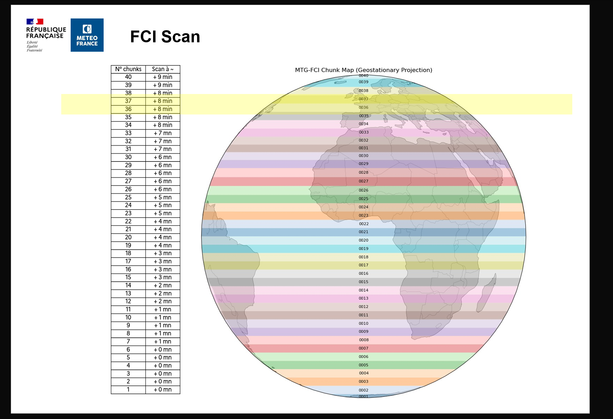

<div align="center">
  
</div>

# COALITION-4 Nowcasting System — Romanian Adaptation

Recurrent-convolutional nowcasting of **rainfall intensity** and **lightning occurrence** over Romania, adapted from MeteoSwiss COALITION-4 (Leinonen et al.).

An encoder-forecaster (ResBlock + ConvGRU) ingests a multi-resolution stack of MTG FCI satellite channels, OPERA composite radar, and LINET lightning, and predicts three lead times: **T+15, T+30, T+45 min**.

- **Grid:** Romania, EPSG:31700 (Stereo70), **1536 × 768** @ ~1 km — a fixed 6 × 3 array of 18 patches of 256 × 256.
- **Area extent:** `(-177324, 77148, 1331353, 723370)` metres.
- **Cadence:** 15 min (configurable — Step 0).
- **Sample window:** 3 past steps (t−30, t−15, t0) → 3 future steps (t+15, t+30, t+45).

Precipitation is driven by the pan-European **OPERA** composite; lightning by **LINET**. Sample selection is DBSCAN over OPERA `rainfall_rate`, so every artefact is tagged `<mode>_dbscan`.

**Contents:** [Resolution tiers](#resolution-tiers) · [Modes](#modes) · [Setup](#environment-setup) · [Table 1 — Training](#table-1--training-a-model-from-scratch) · [Table 2 — Validation & inference](#table-2--validation-inference-visualisation--analysis) · [Table 3 — Architecture defaults](#table-3--architecture--training-defaults) · [Table 4 — Artefact map](#table-4--artefact-map) · [Outputs](#outputs-reference) · [Thresholds](#thresholds-reference) · [Data products](#data-products)

---

## Resolution tiers

Two input tiers. **Always read the physical resolution, not the tier name.**

| Tier | Native | Patch | Pooling | Channels |
|---|---|---|---|---|
| `past_hr` — high resolution | 1 km | 256 × 256 | none | MTG `vis_06`; LINET `density`, `current`, `occurrence` |
| `past_mr` — medium resolution | 2 km | 128 × 128 | 2 × 2 avg | OPERA `reflectivity`, `rainfall_rate`; MTG `ir_38`, `ir_105`, `wv_63`, `wv_73` |

> **Why "medium" when MR is the coarsest tier?** There used to be a third tier (`past_lr`, 3 km, 64 × 64, 4 × 4 pooling) carrying MSG SEVIRI and NWCSAF. Both products were retired and the tier removed, so MR only reads as "middle" relative to that old MSG stack. The name is kept because `past_mr` is baked into the input-tensor names of every trained checkpoint and every dataset's `metadata.json`.

> **On-disk suffix:** extracted patches are named `{variable}_{HHMM}_{HR|MR}.npy` — two suffixes for the two tiers, matching the `past_hr` / `past_mr` input tensors. One vocabulary throughout: **HR is the higher-resolution tier, MR the minimum-resolution one.**

### How multi-resolution inputs are reconciled

**1. Reproject everything to the same 1 km grid first.** `reproject.py` applies a precomputed pyresample KD-tree mapping from each product's native CRS onto the shared 1536 × 768 EPSG:31700 canvas. Afterwards every `.npy` is on the *same* grid and a given patch number maps to the same geographic tile across all products. Cross-scale alignment is paid once per cadence step, not at training time.

**2. Pool *down* to native resolution — never up.** `extract_patches.py` slices 256 × 256 1 km tiles, then average-pools 2 km products to 128 × 128. Upsampling would fabricate pixels: the model would see "1 km OPERA" carrying no genuine 1 km information and would overfit interpolation artefacts. Downsampling preserves the real resolution each instrument actually measured, forcing the encoder to cross scales honestly.

**3. Multi-branch encoder, merging at matching scales.**

```
INPUT  past_hr (256×256, 1 km) ─┐
                                ├─ ResBlock + ConvGRU ─stride 2─┐
                                │                                ▼
       past_mr (128×128, 2 km) ─┴────── concat ─────────────────[merge @128]
                                                                 │
                                                                 ▼
                                                            DECODER → T+15/30/45
```

**4. The model rebuilds itself from `metadata.json`.** Each dataset records its input group names and shapes `[T, H, W, C]`. The builder creates one branch per group, derives each branch's downsample factor as `max_res / branch_res` (1 for HR, 2 for MR), concatenates branches that share a resolution, and sizes the encoder-decoder accordingly. A dataset built from any subset of inputs produces a matching model with no code change; the Swin head from `--stage finetune` inherits the backbone's shape the same way.

---

## Modes

The mode name states its own track: `_rainfall` = OPERA rainfall 5-class, `_logz` = OPERA rainfall in log_zscore space (the SepConv baseline's target), `_occurrence` = lightning binary. There are no aliases.

Every variable each mode consumes, and the label it builds. Inputs are
named exactly as they appear on disk and in `metadata.json`; the label is
always HR (256 px) regardless of the input tiers.

| Mode | HR inputs — 256 px | MR inputs — 128 px | Label source | Label |
|---|---|---|---|---|
| `mtg_opera_radar_only_rainfall` | `vis_06` | `opera_reflectivity` `opera_rainfall_rate` | `opera_rainfall_rate_hr` | rainfall 5-class |
| `mtg_opera_mtgmr_rainfall` | `vis_06` | `opera_reflectivity` `opera_rainfall_rate` `ir_38` `ir_105` `wv_63` `wv_73` | `opera_rainfall_rate_hr` | rainfall 5-class |
| `mtg_lightning_opera_rainfall` | `density` `current` `occurrence` `vis_06` | `opera_reflectivity` `opera_rainfall_rate` `ir_38` `ir_105` `wv_63` `wv_73` | `opera_rainfall_rate_hr` | rainfall 5-class |
| `mtg_lightning_opera_occurrence` | `density` `current` `occurrence` `vis_06` | `opera_reflectivity` `opera_rainfall_rate` `ir_38` `ir_105` `wv_63` `wv_73` | `occurrence` | lightning binary |
| `mtg_opera_occurrence` † | `vis_06` | `opera_reflectivity` `opera_rainfall_rate` `ir_38` `ir_105` `wv_63` `wv_73` | `occurrence` | lightning binary |
| `opera_radar_only_rainfall` ‡ | `opera_rainfall_rate_hr` | — | `opera_rainfall_rate_hr` | rainfall 5-class |
| `opera_sepconv_logz` ‡ | `opera_rainfall_rate_hr` | — | `opera_rainfall_rate_hr` | rainfall `log_zscore` |

Channel counts follow directly: an HR tensor is `(T, 256, 256, n_hr)` and
an MR tensor `(T, 128, 128, n_mr)`, so `mtg_lightning_opera_rainfall`
carries 4 HR and 6 MR channels while `opera_radar_only_rainfall` carries
one MR channel and no HR group at all. A mode with no HR inputs simply
has no `past_hr` tensor — the model is built from whatever groups the
dataset provides.

Two variables name the same field at different tiers:
`opera_rainfall_rate` is the 2 km input pooled to 128 px, while
`opera_rainfall_rate_hr` is the same reprojected field kept at 1 km /
256 px because it is the label. `opera_sepconv_logz` is the one mode that
uses the HR form as **both** input and label, so an autoregressive step
can feed its own output straight back in without changing resolution.

† **KD student only.** Not buildable via `create_datasets.py` — it trains on the teacher's dataset with `past_hr` sliced.

‡ **Baseline comparison pair, radar-only by design** — no MTG, no LINET. Modality enrichment is what RECONVECT is being credited for, so neither the baseline nor its ablation may receive it. Both take **`opera_rainfall_rate_hr` alone, in HR at 256 px**: input parity is the point, so a gap between them is attributable to the architecture rather than to a field one of them was handed. Parity has to mean the same *tensor*, not merely the same field — the MR (2x2-pooled, 128 px) form was used here originally, and while pooling is near-lossless over the domain as a whole, inside wet blocks 79 % are non-constant and 4.3 % of their pixels change class, because the 2 km OPERA cells do not align with the 1 km grid's 2x2 boundaries. The HR form is also load-bearing structurally: the model's output resolution is its **finest input**, and this is the only mode with no other HR channel to hold it at 256, so the MR form emitted 128x128 against a 256x256 label and training died on the shape mismatch — which is why the ablation drops `opera_reflectivity` that the RECONVECT modes keep. `opera_sepconv_logz` additionally needs a **past=4/future=8** sequence window, not the standard one. The modality question is answered separately, against the full model, by the ablation ladder in [Table 2](#table-2--validation-inference-visualisation--analysis). See [SepConv-ens baseline](#sepconv-ens-baseline).

**Rainfall classes (mm/h):** `0: R<10 · 1: 10–20 · 2: 20–30 · 3: 30–40 · 4: R≥40`. The SepConv baseline predicts in `log_zscore` space and is denormalised back to mm/h before being binned at these same edges, so neither model can be favoured by its thresholds.

`mtg_lightning_opera_rainfall` and `mtg_lightning_opera_occurrence` share an identical input stack and differ only in the label head — the natural dual-target pair to train side by side.

---

## Periods and the seasonal ensemble

A **period** is a labelled, inclusive date range — `2025warm` = `2025-04-01 .. 2025-09-30`. Every dataset and every model can carry one, which buys two things: datasets over different ranges stop colliding on disk, and a model reused as a frozen feature extractor can be checked against the dates it is about to be fine-tuned over.

Omitting `--period` everywhere reproduces the old behaviour exactly — `build_run_tag` still returns `{mode}_{source}` and existing artefacts keep their names.

### Season definitions

Ensemble members come from the `[seasons]` block of `training.config` crossed with the years present in `patch_index.csv`. Any number of seasons, any names, any month grouping:

```ini
[seasons]
warm = 4,5,6,7,8,9
cold = 10,11,12,1,2,3
```

**Order encodes the year wrap** — the year advances whenever the month number decreases, so `10,11,12,1,2,3` anchored at 2025 resolves to `2025-10-01 .. 2026-03-31`. Shifting a boundary is a config edit and nothing else. Seasons must be disjoint; they need not cover all 12 months, and any month left unclaimed is reported rather than dropped silently.

### Workflow

| Step | Command | What it does |
|---|---|---|
| **1. Plan** | `python create_datasets.py --mode <mode> --ensemble` | Enumerates members, reports each one's period, coverage and any discrepancy, and registers the plan in `our_data/ensemble_registry.json`. **Builds nothing.** Refuses to register if members overlap. |
| **2. Sequences** | `python extract_patch_seq_for_datasets.py --period 2025warm` | Gates the patch index to the member's dates *before* continuity analysis, so no sequence straddles the boundary. |
| **3. Stats** | `python compute_normalization_stats.py --period 2025warm` | Member-scoped statistics — whole-archive stats would leak dates the member never trains on. |
| **4. Build** | `python create_datasets.py --mode <mode> --period 2025warm` | Builds that one member. The label must be in the registry's latest state. |
| **5. Verify** | `python train_models.py --mode <mode> --check-ensemble` | Reads the registry's last state and reports which member datasets exist and which are missing. Exits non-zero when any are missing. |
| **6. Train** | `python train_models.py --mode <mode> --period 2025warm --stage base` | Artefacts land as `coalition_<mode>_<source>_2025warm.keras`, plus a `.meta.json` sidecar recording the training period. |
| **7. Validate** | `python validate_predictions.py --track rainfall --year Y --month M --mode <mode> --period 2025warm` | Per member. Tunes the hysteresis threshold and writes the `per_patch` CSI table. Manual — nothing triggers it. |
| **8. Select** | `python build_patch_ensemble.py --mode <mode> --track rainfall --year Y --month M` | Reads every member's `per_patch` block and writes the selection manifest. |

The registry is append-only, so an earlier ensemble stays reconstructable and a result produced against a previous plan can still be explained.

### Per-patch selection

Scoring happens **inside `validate_predictions.py`**, not in the ensemble script — at the point where post-processing already runs. Both tracks are therefore scored on the product that actually ships:

| Track | What gets scored |
|---|---|
| Lightning | Hann-blended at stride 128, then hysteresis at the tuned per-lead HIGH |
| Rainfall | Hysteresis on `p(argmax)` at the tuned per-lead HIGH |

Scoring raw model output instead would judge something you never emit. It also has to happen on the full 768 × 1536 canvas — a Hann blend deliberately spans patch boundaries, so it is undefined on an isolated patch.

Each extraction run writes a `per_patch` block into its summary: per-patch CSI, POD, FAR, per-lead breakdown and pooled TP/FP/FN. Counts are pooled and CSI computed once at the end, because CSI is not additive — averaging per-sample scores would weight a sparse sample equally with a busy one.

`build_patch_ensemble.py` is then purely the **selector**: it reads one summary per member, compares per-patch CSI, and writes the manifest. Highest wins; **ties break on the member label**, so the assignment never depends on the order members were validated in. It warns if members were scored at different LOW thresholds, since their CSI values would not be strictly comparable.

Both scripts are run manually after training — nothing is triggered automatically.

```bash
# once per member
python validate_predictions.py --track rainfall --year 2025 --month 07 \
    --mode mtg_opera_mtgmr_rainfall --period 2025warm

# then select
python build_patch_ensemble.py --mode mtg_opera_mtgmr_rainfall \
    --track rainfall --year 2025 --month 07
```

### Rainfall hysteresis sweep

The lightning track already tuned its HIGH threshold over a 0.91–0.99 grid and persisted the result. The rainfall track now does the same, but shaped to its own scale: **LOW is held fixed and HIGH sweeps upward from it in 0.01 steps until a set margin.**

| | |
|---|---|
| LOW | `--rainfall_low_threshold`, default `0.35` (`DEFAULT_RAIN_LOW`) |
| HIGH grid | `low + 0.01 … low + margin`, step `0.01` |
| Margin | `--rainfall_high_margin`, default `0.30` → 30 candidates, `0.36 … 0.65` |

The default margin spans the operational `DEFAULT_RAIN_HIGH` of 0.55, so the currently shipped setting is always inside the swept range and the sweep can only improve on it. The per-lead winner maximises aggregate CSI; on a tie the **lower** threshold wins, which is the conservative choice. Results land in `post_processing` in the rainfall summary, mirroring the lightning schema.

Every candidate's per-patch counts are pooled during the sweep, so once a winner is picked its per-patch table already exists — no second inference pass.

This closes a real gap: rainfall was previously **validated on raw argmax but shipped with hysteresis**, so validation numbers did not describe the emitted product.

The manifest is the ensemble. Inference reads it rather than re-scoring, so repeated validations resolve the same members and reproduce the same numbers. `knowledge_cutoff` records the latest training-period end across all members — it moves only when a member is retrained and the manifest rebuilt.

At inference, `ensemble_inference.PatchEnsemble` routes each patch: the manifest's verified assignment first; for a patch no member ever scored, the member whose season contains the target date; failing that, the member that won the most patches. Fallbacks are reported, never silent — a patch served by one is not backed by evidence.

### Dataset archiving

TFRecord shards compress extremely well — the label tensors are one-hot and mostly zeros, and the normalised inputs repeat heavily. Measured on a real shard from this project:

| Level | Size | Time per 286 MB |
|---|---|---|
| `-mx=1` | **11.5 %** of original (~8.7×) | ~1 s |
| `-mx=5` | **4.8 %** of original (~20.8×) | ~19 s |

A 66 GB member becomes roughly 3 GB. `compress_datasets.py` manages this, using 7-Zip (autodetected at `C:\Program Files\7-Zip\7z.exe`; `--sevenzip` overrides).

**Compression happens once, right after creation.** Training never modifies a dataset, so that archive stays valid for its lifetime — which makes the post-training step a *delete*, not another compression pass.

```
create_datasets --period 2025warm
  └─ writes shards → spawns a detached ARCHIVE job → returns immediately
                     (build the next member while this one compresses)

train_models --period 2025warm
  ├─ restores the dataset if it is archive-only  (blocking — needs the bytes)
  ├─ holds an in-use marker for the run
  └─ spawns a detached RECLAIM job → returns immediately
```

| Command | Effect |
|---|---|
| `python compress_datasets.py` | List every dataset: on disk, archived, or both, with sizes and reclaimable totals. |
| `--compress TAG` | Archive, verify, delete the shards. `--background` detaches. |
| `--restore TAG` | Extract back onto disk. The archive is kept. |
| `--reclaim TAG` | Drop the on-disk copy of an already-archived dataset, after re-verifying the archive. Compresses first if no archive exists. |
| `--reclaim-all` | Sweep every dataset that is archived, still on disk, and not in use — the cleanup for leftovers from an interrupted run. |
| `--jobs` | Background job state: running, ok, failed, or `pending-delete`. |

Opt out of the automatic jobs with `--no-archive` on either `create_datasets.py` or `train_models.py`.

**Concurrency.** Each dataset gets a lock in `our_data/datasets/_archive_jobs/`, so two 7-Zip processes can never write the same archive. Training takes an `.inuse` marker on the same dataset; an archive job that finds one keeps the archive and **skips its delete step**, recording `pending-delete` for a later reclaim. That is what makes *build a member, then immediately train it* safe — the shards are not pulled out from under the run. Markers are PID-stamped, so a crashed run does not block the dataset forever.

**Deletion safety.** The source is removed only after all three of: 7-Zip exits 0, `7z t` passes on the archive, and the archive's file count matches what was on disk. Any failure leaves both copies. A reclaim that finds a *corrupt* archive refuses to delete the only good copy and says so.

One consequence worth planning around: between the archive job finishing and the reclaim completing you hold the uncompressed dataset *and* its archive. That peak is unavoidable if you want the archive built while training proceeds.

### Period-tagged artefacts

`--period LABEL` selects a window's artefacts as a set — the split CSVs, the
sequence metadata, the normalization statistics, the class priors, the
dataset, the weights and the evaluation output all carry the same tag.
Omitting it means the untagged whole-archive run.

**Every script that reads a tagged artefact takes the flag**, and that had to
be swept: `evaluate_coalition`, `predict_full_domain`, `validate_predictions`,
`visualize_gt_vs_pred` and `data_statistics` were resolving tagged artefacts
to the *untagged* name, and `train_models.load_class_fractions` did the same
for the class priors while its two sibling loaders were already correct.

That class of bug is worth understanding because only one of its symptoms is
loud. A missing file raises. **Mismatched normalization statistics do not** —
a z-value only means something against the mean/std that produced it, so
inverting with another window's constants returns plausible mm/h biased
monotonically with intensity, and calibration absorbs the bias into its
thresholds. It surfaces as a skill difference that is not real.

Two scripts stay period-less by design: `verification_keys.py` spans *two*
windows and so takes `--reconvect_tag` / `--sepconv_tag`, and
`build_patch_ensemble.py` reads its periods from the ensemble registry.

### Where the data lives

Every default path resolves against **the repository**, not the working
directory. `./our_data` used to mean the scripts only worked when invoked from
the repo root; run one from anywhere else and it would quietly create an empty
tree beside you instead of finding the real one. Nothing needs a `cd` now.

`datasets/` resolves **separately** from `data_root`, because the two have very
different sizes and lifetimes: the patch pool and reprojected archive are
terabytes that stay put, while a TFRecord dataset is tens of gigabytes that may
need to sit on whichever disk has room this month. That separation previously
required an NTFS junction.

| Root | Flag | Environment variable | Default |
|---|---|---|---|
| patches, split CSVs, statistics | `--data_root` | `COALITION4_DATA_ROOT` | `<repo>/our_data` |
| built TFRecord datasets | `--datasets_root` | `COALITION4_DATASETS_ROOT` | `<data_root>/datasets` |
| checkpoints and history | `--model_dir` | `COALITION4_MODEL_DIR` | `<repo>/models` |

Precedence is **flag > environment variable > default**, so a shell can export a
root once for a whole run sequence and any single command can still override it:

```bash
export COALITION4_DATASETS_ROOT=D:/nowcasting/datasets
python create_datasets.py --mode opera_radar_only_rainfall --period w34 --no-archive
python train_models.py --config training.config --mode opera_radar_only_rainfall --period w34 --stage base
```

or per command:

```bash
python create_datasets.py --mode opera_radar_only_rainfall --period w34 \
    --datasets_root D:/nowcasting/datasets --no-archive
```

`--datasets_root` is accepted by `create_datasets.py`, `train_models.py`,
`train_lightning_kd.py`, `evaluate_coalition.py`,
`evaluate_sepconv_ensemble.py` and `compress_datasets.py` — every script that
reads or writes a dataset. **Archive locks and in-use markers follow it**, so
`_archive_jobs/` lands beside the datasets it guards and the
restore/reclaim lifecycle stays consistent with training.

`train_models.py --output_dir` now defaults to the same place the evaluators
read from, so training from a different working directory no longer strands
checkpoints where evaluation will not look.

**Pass the same roots to every stage of a run.** A dataset built under one
`--datasets_root` and trained under another fails loudly (`FileNotFoundError`),
not silently — but exporting the environment variable avoids the question.

### Bounding the MTG store across disks

The store outgrows one disk at ~47 MB per repeat cycle. `--spill_dir PATH [PATH …]` gives `pipeline_msg_mtg.py` further stores to rotate into, and `--min_free_gb` (default 50) is the threshold: the active store is re-evaluated **before every window and in both directions**, because `--delete_raw` returns space to the disk it is reading from, so a disk that filled up can become the right choice again later. Requires `--batch_months`. `--raw_dir` pins the raw chunks in place while the output store moves, and `mtg_constants.json` is carried into a newly-opened store so it stays reprojectable on its own.

`our_data/satellite_data/store_registry.py` records which date landed where, in `mtg_store_index.json`:

```bash
python our_data/satellite_data/store_registry.py              # summary
python our_data/satellite_data/store_registry.py --verify     # index vs disk
python our_data/satellite_data/store_registry.py --chart      # per-month volume by disk
python our_data/satellite_data/store_registry.py --scan ROOT… # rebuild from disk
```

The index is a claim; disk is the authority, so `resolve` checks the file exists before trusting it. `reproject.py` walks **every registered root** when `--mtg_dir` is absent, rebuilding the KD-tree per store from that store's own constants and writing into the single canonical `reprojected_data/` — so the split is invisible downstream. `summarize_mtg.py --npy_dir` likewise takes several roots and scans them as one archive.

### Compressing the `.npy` stores

The raw arrays are the bulk of the project — **5,292 GB across 1.10 M files**, against ~66 GB of built datasets. They compress just as well as the shards do, but they cannot be archived the same way: the pipeline opens them one frame at a time, by name, from a dozen scripts. So they are compressed **in place**, and every reader resolves the logical `.npy` name to whichever form is on disk. **Nothing needs restoring before a run.**

Measured with zstd level 10 on the `float32` exactly as stored — no dtype change, no requantisation, no byte shuffle, so the numerical base is untouched:

| Target | Files | On disk | Ratio | After |
|---|---|---|---|---|
| `our_data/patches/` | 116,287 | 66.8 GB | 11.3× | 5.9 GB |
| `reprojected_data/satellite_data/MTG/` | 278,345 | 1313.4 GB | 8.8× | 148.5 GB |
| `reprojected_data/opera_data/` | 110,042 | 519.3 GB | 37.6× | 13.8 GB |
| `reprojected_data/lightning_data/` | 160,992 | 314.2 GB | 7110× | ~0 GB |
| `our_data/lightning_data/` | 160,704 | 313.4 GB | 16180× | ~0 GB |
| MTG store (E:) | 194,395 | 1930.8 GB | 5.7× | 336.7 GB |
| MTG store (G:) | 84,005 | 834.4 GB | 7.1× | 117.3 GB |
| **Total** | **1,098,770** | **5292.3 GB** | **8.5×** | **622.3 GB** |

**4.67 TB reclaimed** — more than the multi-disk spill was built to work around. Lightning dominates the ratios because its grids are nearly empty; OPERA is mostly NaN and zeros; MTG radiance is the dense case and sets the floor.

| Command | Effect |
|---|---|
| `python compress_datasets.py --npy-stats DIR` | Sample `DIR` and project the saving. Writes nothing. |
| `--compress-npy DIR [DIR …]` | Compress every `.npy` under `DIR`, verifying each round-trip before deleting the original. |
| `--restore-npy DIR` | Decompress every `.npy.zst` back to `.npy`. |
| `--verify-npy DIR` | Decompress and parse every archive without writing anything. |
| `--zstd-level N` | Default 10. |
| `--npy-workers N` | Default: half the logical cores, capped at 61 (a Windows `ProcessPoolExecutor` limit). |
| `--npy-limit N` | Stop after N files — for trying it on a small sample first. |
| `--keep` | Compress but leave the source in place. |
| `--dry-run` | Show the per-date plan and change nothing. |

Any folder tree works; the walk finds `.npy` at any depth and batches by the dated folder above them, so both on-disk layouts — `nc4_2025-01-01-Romania_ir_105/` for the stores and `2025-01-03/` for the patches — report and resume per date without being told which they are.

```bash
# always look before committing hours of CPU
python compress_datasets.py --npy-stats our_data/reprojected_data

# the big ones
python compress_datasets.py --compress-npy E:\nowcasting\coalition4-rcnn\our_data\satellite_data\MTG G:\nowcasting\mtg_store
python compress_datasets.py --compress-npy our_data/reprojected_data our_data/lightning_data our_data/patches
```

**Why not one solid archive per day?** It was measured and rejected. Over 24 consecutive frames, bundling everything into a single stream buys 3 % (11.3× → 11.7×) and costs random access; a frame-to-frame temporal delta is actually *worse* (10.8×), because the sensor noise between two 5-minute scans compresses less well than the frames themselves.

**Why level 10?** Level 19 reaches 10.7× but runs at 3 MB/s against level 10's ~35 MB/s per worker — days of extra CPU over a store this size, for about 20 % more space.

**Deletion safety.** Each file is compressed to a `.tmp`, read *back off disk*, and compared byte for byte against the original before anything is unlinked. A mismatch leaves both copies and reports the path. What is stored is the entire `.npy` file, header included, so a restore is byte-identical by construction — dtype, shape, byte order and fill values cannot drift. Re-running skips files whose target already exists, so an interrupted pass resumes.

`romania_grid_lats.npy` and `romania_grid_lons.npy` are never compressed. They are ~9 MB in total and are read by nearly everything, including ad-hoc scripts that will never go through the shim.

**Reading compressed data.** `compress_datasets.py` exports the shim the pipeline uses:

| Helper | Replaces |
|---|---|
| `load_array(path)` | `np.load(path)` |
| `array_exists(path)` | `os.path.isfile(path)` for a `.npy` |
| `list_arrays(directory)` | `os.listdir` + `endswith('.npy')` — returns **logical** `.npy` names either way, so filename parsing downstream is unchanged |
| `find_arrays(root)` | a recursive walk, filterable by form |
| `save_array(path, arr, compress=)` | `np.save` |

Routed through it: `reproject.py`, `extract_patches.py`, `identify_patches.py`, `compute_normalization_stats.py`, `create_datasets.py`, `lightning_fraction.py`, `opera_rainfall_fraction.py`, `validate_predictions.py`, `store_registry.py`, and the three summarizers. A compressed frame cannot be memory-mapped; `load_array(..., mmap_mode=...)` raises and names the restore command rather than silently loading the whole array.

### Feature-extractor leakage gate

When `--stage finetune` freezes a base model as a feature extractor, its recorded period is compared against the dataset's. Any shared date aborts:

```
ERROR: Feature-extractor period overlaps the dataset period.
  FE trained on : 2025-01-01 .. 2025-06-30 (2025h1)
  dataset period: 2025-04-01 .. 2025-09-30 (2025warm)
  overlap       : 2025-04-01 .. 2025-06-30 (91 days)
Rebuild the dataset over a disjoint range, or pass --allow_period_overlap to proceed anyway.
```

The comparison uses the periods recorded in the model sidecar and the dataset `metadata.json` — dates, never filenames. A model with no sidecar (anything trained before this existed) reports its period as **unknown**, which prints a warning rather than passing silently; unknown is not the same as safe.

---

## SepConv-ens baseline

A reimplementation of **SepConv-ens** (Czibula et al., *Procedia Computer Science* 246 (2024) 666–675) as a documented comparator for RECONVECT's 5-class rainfall head. The aim is a faithful reimplementation, so that any difference reported is attributable to the architectures rather than to a loose reconstruction of their setup.

### Deviations from the paper

| # | Paper | Here | Why |
|---|---|---|---|
| 1 | 6 reflectivity elevations (R01–R04, R06–R07) | 1 channel, OPERA composite rainfall rate | Different instrument. First layer becomes 1→51; the 51-wide expansion, the 204 concat and the whole trunk are unchanged. |
| 2 | SELU after every separable layer | **Linear** output layer | The target is `log_zscore` rain rate with a tail at z = +9.5, exponentiated downstream. SELU's floor (−λα = −1.7581) would in fact reach the dry value at z = −0.2912, but a saturating nonlinearity in front of a value we exponentiate turns a top-of-range error into a multiplicative one. |
| 3 | 6-minute steps, t+1…t+8 | 15-minute steps, **t+1…t+4 = 15/30/45/60 min** | Our master cadence, and the horizon is capped at t+4 on purpose: those four steps are the ones the composition builds from observations alone (see below). t+5…t+8 would be 75–120 min, past anything the paper validated, and would be autoregressive. |
| 4 | Weighted MSE, weights unpublished | Inverse-frequency by class, capped at 1000× | Their weighting is not in the paper. Ours is derived from measured class fractions and **reported as ours**. |
| 5 | min-max normalisation to [0,1] | `log_zscore` (fill 0.01, clip 0.01) | Matches the space the field is consumed in — input and label are the same field in the same units, which is what would make a rollout possible at all were one used. |
| 6 | `M_{t+4} = Φ₅(M_{t−4}, M_{t−3}, M_{t−3}, M_{t−1})` | `(t−4, t−3, t−2, t−1)` | Transcription error in the paper — `t−3` twice, `t−2` missing. Read literally the frames are non-consecutive; the correction is what makes the step arithmetic land on t+4. |

### Composition scheme

Reproduced in full — the paper's Table 2 shows that replacing it with repeated single-model application costs 3–4× in CSI, so dropping it would make the baseline a strawman. `sepconv_compose.py` **validates the table at import**: it re-derives `last_frame_offset + base_lead` for every entry and refuses to load if that doesn't equal the target step.

| step | t+1 | t+2 | t+3 | t+4 | t+5 | t+6 | t+7 | t+8 |
|---|---|---|---|---|---|---|---|---|
| lead (min) | 15 | 30 | 45 | 60 | 75 | 90 | 105 | 120 |
| model | Bm1 | Bm3 | Bm3 | Bm5 | Bm1 | Bm3 | Bm3 | Bm5 |
| source | observed | observed | observed | observed | autoregressive | autoregressive | autoregressive | autoregressive |
| **in use** | ✓ | ✓ | ✓ | ✓ | — | — | — | — |

**Nothing here is run autoregressively.** The comparison stops at t+4, and
the first four steps read observations only — `compose(predict_fn, frames,
max_step=4)` reuses no predicted frame. Both models therefore make
single-pass predictions over the same four horizons, so a difference
between them cannot be a difference in error accumulation.

Capping the horizon does **not** narrow the input. t+2 and t+4 read
`t−4`, because from four frames ending at `t0` the base leads (1, 3, 5)
reach only +1, +3 and +5 — landing on +2 and +4 requires a window ending
at `t−1`, and therefore a fifth frame. The baseline needs `past=4`
whatever the horizon.

`Bm1/Bm3/Bm5` land at 15/45/75 min on our grid, not the paper's 6/18/30.

### Normalization scoping

Both the statistics and the loss weights are scoped to the model's **own training split**, not shared with RECONVECT. The two models sit on different windows — `w44` for the baseline, `w34` for the ablation — so each has its own statistics file.

The invariant that matters is *not* that the two models share a space — it is that **training and inversion use the same constants**. A z-value only means something relative to the `mean`/`std` that produced it; train under one set and invert with another and `10**(z·std+mean)` recovers the wrong mm/h, biased monotonically with intensity (about −6 % at 30 mm/h for a 1 % difference in std). Nothing raises, and calibration absorbs the bias into its thresholds, so it surfaces as a skill difference that is not real.

RECONVECT's training split contains **36 of the baseline's test timestamps**, so normalising the baseline with RECONVECT's statistics would put its own test data inside the constants defining its space. Scoping per split removes that entirely.

| | value | consumers |
|---|---|---|
| Statistics | `normalization_stats_dbscan_w44.json` | dataset build, `build_sepconv_loss`, `sepconv_predict.to_mmh` |
| Class weights | `opera_rainfall_fraction_dbscan_w44.json` | `build_sepconv_loss` |

**Hyperparameters are shared too.** Both halves read `training.config`:
`[defaults]` supplies `epochs` and `batch_size` to RECONVECT and to the
baseline alike, and the optional `[sepconv]` section overrides them, taking
`learning_rate` from `[lr_schedule].initial_lr` and `es_patience` from
`[early_stopping].patience` when not set. A gap between the two models
therefore cannot be a gap in training budget. Command-line flags still
override the file for one-off sweeps.

**Both leave the same two model states.** A final best-weights save, and a
rolling per-epoch checkpoint under `<model_dir>/checkpoints/` that always
holds the *latest* epoch (plus a `.json` sidecar with the next-epoch index).

| | best weights | last epoch |
|---|---|---|
| ablation | `coalition_<run_tag>.keras` | `checkpoints/<run_tag>_latest.keras` |
| baseline | `sepconv_<run_tag>_bm{1,3,5}.keras` | `checkpoints/sepconv_<run_tag>_bm{1,3,5}_latest.keras` |

The baseline previously had **no** checkpoint at all, so a driver-level CUDA
crash at epoch 40 of 50 lost the whole run — three times over, once per base
model. It now shares RECONVECT's `_ResumableCheckpoint` and its
`[checkpointing]` section, resumes at the right epoch with optimizer state
intact, and takes `--fresh` to ignore a checkpoint. Each base model keeps its
own file: a shared one would have Bm3 resume from Bm1's weights.

Either state is selectable with `--weights best|latest` on both evaluators —
`best` (the default) is the final save, `latest` is the per-epoch checkpoint:

```bash
python evaluate_coalition.py --mode opera_radar_only_rainfall --period w34 --weights latest ...
python evaluate_sepconv_ensemble.py --period w44 --weights latest ...
```

Comparing the two on the frozen verification keys answers whether the epochs
after the best one were overfitting, or whether the run was still improving
when early stopping cut it — which is what tells you if the epoch ceiling was
set sensibly. The baseline resolves all three base models internally, and
`--weights latest` on `--finetuned` picks the finetune stage's own checkpoint
rather than the base one. A missing checkpoint names the files it wanted and
says to drop the flag.

The one thing deliberately *not* unified is the learning-rate schedule:
RECONVECT uses the cosine warmup in `[lr_schedule]`, the baseline reproduces
the paper's `ReduceLROnPlateau` (`[sepconv].lr_patience`). Forcing them
together would mean abandoning the published method, so both are recorded in
the history JSON instead.

Both files must be scoped to the **same** set of training timesteps, and that is checkable: `compute_normalization_stats.load_training_keys` and `lightning_fraction.load_scope_set` should return identical key sets for a given tag (24,066 for `w44`, 24,395 for `w34`). They did not until the midnight-rollover fix — `start_utc`/`end_utc` are clock times with no date, and a window through midnight arrives with `end_utc` numerically *before* `start_utc`. Those rows were dropped as malformed, excluding every 22:00–01:00 timestep from the class priors while the statistics kept them. The row's `date` dates the **reference**, not the start, so the expansion now anchors on `reference_utc` and walks outwards: `reference_utc` 23:45 pushes `end_utc` to the next day, 00:15 pulls `start_utc` back to the previous one.

**No entry point defaults the window tag.** Several windows coexist on
disk, each with its own statistics, so `sepconv_predict.to_mmh` takes
`stats_period` as a required argument and `verification_keys.py` requires
`--sepconv_tag`. A default would silently pick one, and denormalising with
the wrong constants returns plausible mm/h biased with intensity while
raising nothing. `to_mmh` also fails loudly if the file is absent rather
than falling back. `create_datasets.py --global_stats` exists for the
opposite case and prints `<- overridden, decoupled from --period` when
used, but the baseline does **not** use it.

### Sample selection is shared, splits are not

Both models draw from the same `patch_index.csv`, DBSCAN-gated at `DBSCAN_THRESHOLD` = 10 mm/h — that gate is upstream of both. Within a selected patch every pixel is used by both, including the 99.8 % dry ones; there is no per-pixel thresholding. **The weighted loss exists because of that**: plain MSE on this distribution is minimised by emitting the dry value everywhere, at a cost of 0.09 versus 91.6 under the weighting.

The splits differ only because the windows do — `past=4/future=8` needs 13 consecutive timesteps against RECONVECT's 6, so fewer references qualify and SepConv's dates are a strict subset. The Czibula splitter then assigns by position within each 6-hour block, which puts the same key on opposite sides:

```
sepconv_test_in_reconvect_train    41
sepconv_test_in_reconvect_val      51
reconvect_test_in_sepconv_train    10
reconvect_test_in_sepconv_val      27
```

`verification_keys.py` builds the leakage-free set — intersect the two test splits, then subtract every key appearing in either model's train or validation. On `w34` vs `w44`: **4,745 clean keys**, 1,643 reference times, 358 dates, 14/18 patches (6, 12, 17, 18 are absent and cannot carry a per-patch claim). Freeze it with `--write` before the test data is scored.

```
RECONVECT (w34) test   : 5420      sepconv_test_in_reconvect_train      7
SepConv   (w44) test   : 5125      sepconv_test_in_reconvect_val      373
naive intersection     : 4745      reconvect_test_in_sepconv_train      1
dropped as contaminated:    0      reconvect_test_in_sepconv_val       22
```

The subtraction is a no-op — a key in one model's validation set cannot also be in its own test split, so it never survives the intersection. **The intersection is what does the work**, removing 12–13 % of each test split. And the leakage is real in the other direction: 380 of the baseline's test keys were seen by RECONVECT during fitting.

The frozen file is **enforced, not advisory**, and on **both** sides of the comparison — `evaluate_sepconv_ensemble.py --verification_keys PATH` for the baseline and `evaluate_coalition.py --verification_keys PATH` for the ablation. Pass the *same* file to both; scoring them on different key sets is the failure this exists to prevent. Without the flag either evaluator scores its full split and prints why that is not comparable. This requires the `date` and `reference_utc` fields in the TFRecord shards — datasets built before those existed parse them as `""`, match no key, and are refused with an instruction to rebuild rather than silently scored on nothing.

### Patch pool staleness

`our_data/patches/` is shared by every period and mode — a patch file is a pure function of (date, time, variable, resolution) and `patch_index.csv`, so `w44` and `w34` produce the same file and the second run is largely a no-op. The pool is **not** invalidated by a new period. It is invalidated by exactly one thing: **`patch_index.csv` changing.**

The reason that matters is the file format. A patch file is an array of tiles with nothing recording which tile is in which slot — slot *k* means "the *k*-th active patch at this timestep", and that ordering lives only in the index. When a patch becomes active it **inserts into the middle of the list** and shifts every later slot by one:

```
file holds  : [2, 3, 4,    7, 8, 9, 13, 14]     (8 tiles, written earlier)
index says  : [2, 3, 4, 5, 7, 8, 9, 13, 14]     (9 tiles, after a re-run)
              ok ok ok  ^--- every slot from here on is off by one
```

Only the last slot goes out of range. The five shifted slots stay in range and **read cleanly while returning the wrong tile** — patch 5 and patch 7 are ~1,000 km apart on the 1536 × 768 km domain, so training pairs one region's input with another region's label. Shapes are right, the loss falls, nothing raises.

Because `extract_patches` skips files that already exist, that state is sticky — nothing regenerates them. Two guards close it:

| guard | where | what it does |
|---|---|---|
| **Stamp** | `our_data/patches/<date>/_patch_index.json` | Records the active-patch list every file in that date was built from, plus the index's SHA-256. `extract_patches` compares per timestep and **re-extracts** any whose list has moved, instead of skipping. Merged on write, so a `--date` run doesn't erase the rest. |
| **Raise** | `create_datasets.StalePatchPool` | An out-of-range `idx_t*` was previously zero-filled. It now raises, naming the date, timestep, variable, requested slot and actual length. |

```bash
python extract_patches.py --audit_pool [--period TAG]    # report drifted dates, extract nothing
```

The raise is deliberately *not* extended to a **missing** variable, which stays zero-filled — a mode may legitimately reference a product with gaps. An out-of-range slot is never legitimate.

Note the asymmetry: the raise catches only the one detectable slot; the stamp is what catches the silently-shifted ones. Zero-filling the detectable case would have hidden the only evidence that the rest were wrong.

**Overwriting a stale file also deletes its `.npy.zst` twin**, so a compressed shadow copy cannot resurrect the old tiles.

> **Ordering, if you compress the pool:** compression rewrites every file's mtime. For a pool built *before* stamping, mtime against `patch_index.csv` is the only evidence of staleness — so purge stale files **before** running `--compress-npy our_data/patches`, or that evidence is gone and the only repair left is deleting the whole pool.

### Running the comparison

Two windows, because the baseline and the ablation need different input
widths:

| tag | window | steps | samples | for |
|---|---|---|---|---|
| `w44` | past=4 / future=4 | 9 | 20,851 | `opera_sepconv_logz` — needs `t−4` for its t+2 and t+4 steps |
| `w34` | past=3 / future=4 | 8 | 21,525 | `opera_radar_only_rainfall` — 3 past + current = 4 input frames |

Order matters: the statistics must exist before the dataset is built, and
the verification keys must be frozen before any model sees test data.

```bash
# --- 1. Sequence windows ----------------------------------------------
python extract_patch_seq_for_datasets.py --period w44 \
    --start 2025-01-01 --end 2026-08-13 --past 4 --future 4
python extract_patch_seq_for_datasets.py --period w34 \
    --start 2025-01-01 --end 2026-08-13 --past 3 --future 4

# --- 2. Patches, statistics, class priors ------------------------------
python extract_patches.py --period w44 --products opera
python extract_patches.py --period w34 --products opera
python compute_normalization_stats.py --period w44 --variables opera_rainfall_rate opera_reflectivity
python compute_normalization_stats.py --period w34 --variables opera_rainfall_rate opera_reflectivity
python opera_rainfall_fraction.py --period w44
python opera_rainfall_fraction.py --period w34

# --- 3. Freeze the verification keys BEFORE any training ---------------
python verification_keys.py --write --reconvect_tag w34 --sepconv_tag w44

# --- 4. Datasets -------------------------------------------------------
python create_datasets.py --mode opera_sepconv_logz        --period w44 --no-archive
python create_datasets.py --mode opera_radar_only_rainfall --period w34 --no-archive

# --- 5. Training -------------------------------------------------------
python sepconv_ensemble_training.py --period w44          # Bm1, Bm3, Bm5
python train_models.py --config training.config --mode opera_radar_only_rainfall --period w34 --stage base

# --- 6. Evaluation -----------------------------------------------------
python evaluate_sepconv_ensemble.py --period w44 \
    --verification_keys our_data/verification_keys_dbscan_w34_vs_w44.json
python evaluate_coalition.py --mode opera_radar_only_rainfall --period w34 \
    --verification_keys our_data/verification_keys_dbscan_w34_vs_w44.json
```

Both `create_datasets` runs must print a period-suffixed statistics file
with **no** `<- overridden` note — each model is normalised by its own
split, so `--global_stats` must be absent from both.

The two `extract_patches` runs write into the same shared `patches/`
tree, so the second is largely a no-op over the overlap.

The ablation takes `opera_rainfall_rate` only — one channel, matching the baseline. A second consequence of that choice is practical: the coverage manifest represents OPERA by `opera_rainfall_rate`, so a timestep holding rainfall but not reflectivity passes the gate and would then be dropped at build time without an error. Rainfall-only makes the gate and the mode agree.

Reclaim the ~86 GB of TFRecords afterwards with `python compress_datasets.py --reclaim-all`.

### Comparison scope

Results license **single RECONVECT vs SepConv-ens** claims only. The seasonal ensemble is a separate chapter, not this comparison. Comparative metrics cover **all four horizons — 15/30/45/60 min** — because both models predict them in a single pass from observations; t+5…t+8 are not produced. **RMSE never appears in the comparison table**: native-unit metrics are per-model characterisation only, and the two models do not predict in the same units.

---

## Environment Setup

Requires **Conda**, an **NVIDIA GPU**, and **Windows**. Follow this order exactly; it sidesteps the two Windows traps.

1. **Install CUDA 11.2 + cuDNN 8.1 via the NVIDIA installers** — *not* `conda install cudatoolkit=11.2 cudnn=8.1.0`, which silently downgrades Python 3.10 → 3.9 (conda-forge has no CUDA 11.2 builds for 3.10). Then confirm `CUDA_PATH` is set — Python 3.8+ on Windows no longer honours `PATH` for DLL loading in C extensions, so TensorFlow finds CUDA through `CUDA_PATH` specifically:
   ```powershell
   setx CUDA_PATH "C:\Program Files\NVIDIA GPU Computing Toolkit\CUDA\v11.2"
   ```
   `setx` only affects newly-launched shells — open a fresh terminal afterwards.
2. **Create the env** (3.10 is the last Python with native Windows TF GPU support):
   ```powershell
   conda create -n tfenv python=3.10 -y; conda activate tfenv
   python --version    # MUST still print 3.10.x at every step below
   ```
3. **Geospatial stack via conda-forge first**, so `pyproj` / `proj` / `geopandas` / `cartopy` / `pyresample` share one PROJ ABI. Pip-installing these on Windows yields mismatched `proj.db` paths and every CRS lookup then fails with `Invalid projection: … no database context specified`:
   ```powershell
   conda install -c conda-forge -y pyproj proj geopandas pyogrio shapely cartopy pyresample pykdtree netCDF4 xarray hdf5plugin h5py
   ```
4. **Remaining deps, then the local package** (`c4dl.projection` is imported by several scripts):
   ```powershell
   pip install -r requirements.txt; pip install -e .
   ```
5. **Verify both PROJ and the GPU:**
   ```powershell
   python -c "import pyproj; print(pyproj.CRS('EPSG:4326'))"
   python -c "import tensorflow as tf; print(tf.config.list_physical_devices('GPU'))"
   ```
   An empty `[]` plus `Could not load dynamic library 'cudart64_110.dll'` means this shell can't see `CUDA_PATH` — reopen the terminal.

---

## Table 1 — Training a model from scratch

Run in step order. Steps 9a/9b are conditional on the track; 11–12 are optional.

> **Reading the tables.** Tokens in $\color{red}{\textbf{\textit{red bold italic}}}$ are **placeholders you must supply** — they are not in this repository. Everything else in the example commands is a literal path the pipeline produces or reads.
>
> **Date formats differ by script** — there are two conventions, and the end bound is not uniform:
>
> | Format | Used by | End bound |
> |---|---|---|
> | `yyyy/mm/dd-hhmm` | `pipeline_msg_mtg.py`, `pipeline_opera.py` | OPERA **inclusive**; MTG unspecified |
> | `YYYY-MM-DD` | `linet_export.py`, `read_kml_version2.py`, `reproject.py`, `identify_patches.py`, `extract_patches.py`, `predict_full_domain.py`, `validate_predictions.py`, `evaluate_*.py` | `linet_export` **EXCLUSIVE**; `identify_patches` **inclusive** |
> | `HH:MM` · integer | `--time`, `--start-time`, `--end-time` · `--hour` 0–23, `--year`, `--month` 1–12 | — |
>
> The exclusive bound on `linet_export.py` is the one that bites: `--end 2025-05-31` silently stops at 30 May.

| # | Script | Arguments | What the step does | Commands |
|---|---|---|---|---|
| **0** | `validate_timestep.py` | `--step_minutes N` desired master training cadence, in minutes · `--cadences_file PATH` per-product native cadence config file · `--output_path PATH` where the generated timestep config lands · `--print` show the existing config and exit | Picks the master cadence and derives each product's minute filter → `our_data/timestep_config.json`, read by every later step. | `python validate_timestep.py --step_minutes 15`<br>`python validate_timestep.py --print` |
| **1a** | `our_data/satellite_data/pipeline_msg_mtg.py` | `--start` `--end` `yyyy/mm/dd-hhmm` download window, both required · `--source nma\|datastore\|both\|local` which archive to pull from, or none · `--password_file PATH` SSH password; only for the NMA server · `--eumdac_credentials PATH` two-line EUMDAC key and secret · `--missing_json PATH` gap list driving `--source datastore` · `--fill_dry_run` list Data Store fetches without downloading · `--no_fill_incomplete` recover only fully-absent cycles · `--batch_months N` run the range in N-month windows, one at a time · `--stop_on_error` abort at the first failed window instead of continuing · `--products_file PATH` JSON listing which FCI channels to fetch · `--output_dir PATH` destination root for downloaded MTG data · `--timesteps` override the per-product minute filter · `--workers N` parallel download and processing worker count · `--full_disk` fetch full disk instead of Romania chunks · `--skip_download` process local raw chunks without downloading · `--reprocess` re-extract cycles whose `.npy` already exist · `--delete_raw` reclaim each wave's raw chunks as it extracts · `--delete_only` delete raw chunks without re-extracting first · `--provenance nma\|datastore` origin to stamp on a `--source local` pass · `--record_existing nma\|datastore` stamp everything already on disk, then exit | Downloads and extracts MTG FCI L1C. **The source is your choice** and is recorded per cycle in `provenance.json`: `nma` (default) is the internal server, `datastore` fetches only the cycles `mtg_missing_timesteps.json` lists as missing — so run step 2a first — `both` does NMA then fills the remainder, and `local` downloads nothing at all, extracting raw already in `_raw_chunks/`. | `python our_data/satellite_data/pipeline_msg_mtg.py --start 2025/05/01-0000 --end 2025/05/31-2350 --password_file $\color{red}{\textbf{\textit{creds.txt}}}$<br>`… --source datastore --eumdac_credentials `$\color{red}{\textbf{\textit{eumdac.txt}}}$<br>`… --source local --delete_raw --provenance nma` |
| **1b** | `our_data/opera_data/pipeline_opera.py` | `--start` `--end` `yyyy/mm/dd-hhmm` window, **end inclusive** · `--ssh_key PATH` SSH private key; excludes `--password_file` · `--password_file PATH` text file holding the SSH password · `--products` reflectivity, rainfall_rate, or both by default · `--remote_base PATH` remote EWC mount root directory · `--remote_host` `--remote_user` SSH endpoint and login account · `--cache_dir PATH` local OPERA destination root directory · `--timesteps` override the per-product minute filter | Fetches OPERA composite HDF5. If the default `--remote_base /eumetsatdata` errors with "No such file", pass `/home/eumetsatdata` — the mount root differs between EWC images. | `python our_data/opera_data/pipeline_opera.py --start 2025/05/01-0000 --end 2025/05/31-2359 --ssh_key `$\color{red}{\textbf{\textit{path/to/ssh-key}}}$<br>`… --remote_base /home/eumetsatdata` |
| **1c** | `our_data/lightning_data/linet_export.py` | `--start` `--end` `YYYY-MM-DD` period, **end EXCLUSIVE** · `--format` txt point list, kml, or asc · `--out PATH` destination root for the exported strokes · `--bbox` lon/lat rectangle limiting the export area · `--password_file PATH` text file holding the LINET password · `--lightning-type` 0 all, 1 cloud-to-ground, 2 intracloud · `--amp-threshold` minimum stroke amplitude to keep · `--daily-window` split the request into per-day windows · `--pause` seconds to wait between successive requests · `--force` re-download even when the output exists · `--dry-run` plan the fetch without downloading anything | Downloads LINET strokes. Use `--format kml`: it writes `{out}/kml_data/YYYY-MM-DD/…` which the rasteriser reads directly. | `python our_data/lightning_data/linet_export.py --start 2025-05-01 --end 2025-06-01 --format kml --out our_data/lightning_data --password_file `$\color{red}{\textbf{\textit{creds.txt}}}$<br>*(`--end 2025-06-01` to cover all of May — the bound is exclusive)* |
| **1d** | `our_data/lightning_data/read_kml_version2.py` | `--data_root PATH` root holding the downloaded KML files · `--output_root PATH` destination for the rasterised grid arrays · `--date YYYY-MM-DD` process one date instead of all · `--force` reprocess and overwrite the existing outputs | Rasterises strokes onto the 1 km Romania grid → `density`, `current`, `occurrence`. | `python our_data/lightning_data/read_kml_version2.py --data_root our_data` |
| **2** | `reproject.py` | `--satellite MTG` \| `--lightning` \| `--opera` \| `--all` product family; mutually exclusive, one required · `--data_root PATH` root containing the raw product folders · `--date YYYY-MM-DD` process a single date only · `--workers N` parallel day-folder worker processes | Regrids everything onto the 1536 × 768 EPSG:31700 canvas as `.npy`. Also writes the shared `romania_grid_{lats,lons}.npy` and per-source projection constants so the arrays stay self-recoverable. | `python reproject.py --all`<br>`python reproject.py --opera --workers 6`<br>`python reproject.py --satellite MTG --date 2025-05-14` |
| **2a** | `our_data/satellite_data/summarize_mtg.py` | `--start` `--end` `YYYY-MM-DD` range the archive should cover · `--scan npy\|raw\|reprojected` measure from the extracted store, the raw chunks, or the reprojected arrays `extract_patches` actually reads · `--npy_dir PATH` MTG root holding the per-channel arrays · `--raw_dir PATH` directory of downloaded FCI chunk files · `--output PATH` per-date coverage summary CSV destination · `--missing PATH` missing-timestep JSON destination · `--timesteps` override the cadence minute filter · `--chart [PATH]` monthly coverage chart PNG | Per-date MTG coverage → `mtg_summary.csv` + `mtg_missing_timesteps.json`, consumed by step 3 **and** by `--source datastore` as its shopping list. Also reports the NMA / Data Store split from `provenance.json`. **Give `--start` and `--end`** — without them the range is inferred from the files found, so a date absent from disk is not reported missing and can never be requested. | `python our_data/satellite_data/summarize_mtg.py --start 2025-01-01 --end 2026-08-13 --chart`<br>`python our_data/satellite_data/summarize_mtg.py --scan raw` |
| **2b** | `our_data/opera_data/summarize_opera_data.py` | `--start` `--end` `YYYY-MM-DD` range the archive should cover · `--data_dir PATH` local OPERA download root to scan · `--products` reflectivity, rainfall_rate, or both · `--timesteps` override the per-product minute filter · `--output PATH` per-date coverage summary CSV destination · `--missing PATH` missing-timestep JSON destination · `--chart [PATH]` monthly coverage chart PNG | Same for OPERA → `opera_summary.csv` + `opera_missing_timesteps.json`. | `python our_data/opera_data/summarize_opera_data.py --start 2025-01-01 --end 2026-08-13 --chart`<br>`python our_data/opera_data/summarize_opera_data.py --products opera_rainfall_rate` |
| **2c** | `our_data/lightning_data/summarize_lightning_data.py` | `--start` `--end` `YYYY-MM-DD` range the cache should cover · `--data_dir PATH` rasterised lightning `.npy` root to scan · `--workers N` parallel workers for the per-date scan · `--output PATH` per-date coverage summary CSV destination · `--active PATH` per-timestep activity index CSV destination · `--chart [PATH]` monthly coverage chart PNG | Same for LINET → `lightning_summary.csv` + `lightning_active_steps.csv`. Every array is read in full to test for a non-zero pixel, so the scan is disk-bound and parallel by default. The activity index also feeds `lightning_fraction.py --scope_csv` and `visualize_lightning_stats.py`. | `python our_data/lightning_data/summarize_lightning_data.py --start 2025-01-01 --end 2026-08-13 --chart`<br>`python our_data/lightning_data/summarize_lightning_data.py -w 12` |
| **3** | `intersect_product_coverage.py` | `--summary name=PATH` per-product coverage summary CSV; `name` is `mtg`, `lightning`, `opera_rainfall_rate` or `opera_reflectivity` (`opera` is an alias for the former) · `--missing name=PATH` per-product missing-timestep JSON · `--active name=PATH` per-timestep activity index CSV · `--errors_log PATH` reprojection error log to subtract · `--timestep_config PATH` master cadence config to validate against · `--output_csv PATH` where the timestep manifest is written · `--output_plot PATH` destination for the coverage bar chart | Intersects per-product coverage into `timestep_manifest.csv` — the timesteps where *all* requested products exist. Gates step 5. **The requested set is your choice**, and OPERA's two fields are named separately so a manifest requires only what its modes read: both OPERA keys draw on the same summary CSV and missing JSON, selecting different blocks. | `python intersect_product_coverage.py --summary mtg=our_data/satellite_data/mtg_summary.csv --summary opera_rainfall_rate=our_data/opera_data/opera_summary.csv --summary opera_reflectivity=our_data/opera_data/opera_summary.csv`<br>`python intersect_product_coverage.py --summary opera_rainfall_rate=our_data/opera_data/opera_summary.csv --output_csv our_data/timestep_manifest_rain.csv` |
| **4** | `identify_patches.py` | `--threshold` mm/h rain-rate floor for DBSCAN clustering · `--eps` DBSCAN neighbourhood radius, in pixels · `--min_samples` minimum pixels needed to accept a cluster · `--data_root PATH` root holding the reprojected OPERA data · `--output_dir PATH` destination for the patch index CSV/JSON · `--date YYYY-MM-DD` single date; excludes `--start`/`--end` · `--start` `--end` `YYYY-MM-DD` range, **both bounds inclusive** · `--plot` save one PNG per active timestamp | DBSCAN over OPERA `rainfall_rate`; marks which of the 18 patches are convectively active per timestep → `patch_index.csv`. | `python identify_patches.py`<br>`python identify_patches.py --start 2025-05-01 --end 2025-05-31`<br>`python identify_patches.py --date 2025-05-14 --plot` |
| **5** | `extract_patch_seq_for_datasets.py` | `--past N` past steps required before the reference · `--future N` future steps required after the reference · `--test_frac` fraction of each block held for test · `--val_frac` fraction of each block held for validation · `--block_hours N` temporal block size; must divide 24 · `--manifest PATH` coverage gate; `none` disables the filter · `--data_root PATH` root holding the patch index CSV | Builds temporally-continuous sequences and the Czibula block-wise 80/10/10 split → `{train,validation,test}_data_dbscan.csv` + `sequence_meta_dbscan.json`. | `python extract_patch_seq_for_datasets.py`<br>`python extract_patch_seq_for_datasets.py --past 3 --future 3 --block_hours 12`<br>`python extract_patch_seq_for_datasets.py --manifest none` |
| **6** | `extract_patches.py` | `--products` satellite_MTG, lightning, opera; default all three · `--data_root PATH` root holding the reprojected full-domain canvases · `--output_dir PATH` destination for the sliced patch arrays · `--date YYYY-MM-DD` process a single date only | Slices 256 × 256 patches from the reprojected canvases, applying each variable's pooling factor → `patches/{date}/{var}_{HHMM}_{HR\|MR}.npy`. | `python extract_patches.py`<br>`python extract_patches.py --products satellite_MTG opera`<br>`python extract_patches.py --date 2025-05-14` |
| **7** | `compute_normalization_stats.py` | `--variables` restrict to a subset of variables · `--sample_fraction` fraction of pixels sampled per file · `--with_percentiles` also emit p01/p50/p99 and MAD · `--reservoir_size` reservoir sample size backing the percentiles · `--device auto\|cpu\|gpu` compute backend for the accumulation · `--no_split_filter` **DIAGNOSTIC ONLY — leaks val/test data** · `--train_csv PATH` training split scoping the statistics · `--sequence_meta PATH` sequence schema describing the sample window · `--timestep_config PATH` master cadence for per-product snapping · `--reproject_root PATH` root holding the reprojected product data · `--output PATH` destination for the statistics JSON · `--seed` RNG seed for reproducible pixel sampling | Per-variable mean/std over the **training split only** → `normalization_stats_dbscan.json`. Required by step 8; there is no fallback, and a missing variable fails loudly. | `python compute_normalization_stats.py`<br>`python compute_normalization_stats.py --variables ir_105 opera_rainfall_rate`<br>`python compute_normalization_stats.py --device gpu --with_percentiles` |
| **8** | `create_datasets.py` | `--mode` one of the buildable dataset modes · `--data_root PATH` root holding split CSVs and patches · `--output_root PATH` destination root for the TFRecord datasets | Applies transforms + label binning, writes TFRecord shards plus a per-split `metadata.json` (input shapes, label type, cadence) that drives model construction. | `python create_datasets.py --mode mtg_opera_mtgmr_rainfall`<br>`python create_datasets.py --mode mtg_lightning_opera_occurrence` |
| **9a** | `lightning_fraction.py` | `--scope_csv PATH` scope CSV; `none` scans every file · `--data_root PATH` root holding the lightning patch arrays · `--output PATH` destination for the focal-loss prior JSON | **`_occurrence` modes only** (`mtg_lightning_opera_occurrence`, `mtg_opera_occurrence`). Training-scope positive-pixel fraction → `lightning_fraction_dbscan.json`, the focal-loss prior. | `python lightning_fraction.py`<br>`python lightning_fraction.py --scope_csv none` |
| **9b** | `opera_rainfall_fraction.py` | `--scope_csv PATH` scope CSV; `none` scans every file · `--data_root PATH` root holding the OPERA patch arrays · `--output PATH` destination for the class-weight prior JSON | **`_rainfall` modes only, when `[radar_loss].weighting != none`.** Per-class pixel fractions → `opera_rainfall_fraction_dbscan.json`, the class-weight prior. | `python opera_rainfall_fraction.py` |
| **10** | `train_models.py` | `--config PATH` training config carrying all hyperparameters · `--mode` train one mode instead of the list · `--stage base\|finetune\|both` base training, Swin head, or both · `--base_checkpoint PATH` frozen backbone for the finetune stage · `--dataset_dir PATH` override the derived dataset directory · `--output_dir PATH` destination for saved models and history · `--data_root PATH` root holding datasets and loss priors · `--fresh` ignore any saved per-epoch checkpoint · `--list-modes` print the mode registry and exit | Builds the encoder-forecaster from `metadata.json` and trains. `finetune` freezes the backbone and grafts a Swin head; `both` runs the two back-to-back in one process. Resumes from the per-epoch checkpoint unless `--fresh`. | `python train_models.py --list-modes`<br>`python train_models.py --mode mtg_opera_mtgmr_rainfall --stage base`<br>`python train_models.py --mode mtg_lightning_opera_occurrence --stage both`<br>`python train_models.py --config training.config`<br>`python train_models.py --mode mtg_opera_mtgmr_rainfall --stage base --fresh` |
| **11** | `train_lightning_kd.py` | `--kd_alpha` weight on the soft-teacher distillation loss · `--kd_temperature` softening temperature for both models' outputs · `--teacher_finetuned` distil from the Swin teacher instead · `--epochs` `--batch_size` training length and samples per step · `--learning_rate` Adam learning rate for the student · `--patience` early-stopping patience, counted in epochs · `--shuffle_buffer` samples held in RAM for shuffling · `--seed` RNG seed for reproducible student training · `--no_mixed_precision` disable fp16 compute on tensor cores · `--data_root` `--model_dir` dataset root and checkpoint destination | **Optional.** Distils the teacher into `mtg_opera_occurrence`, a student predicting lightning from satellite + OPERA with **no LINET at inference**. | `python train_lightning_kd.py`<br>`python train_lightning_kd.py --kd_alpha 0.5 --kd_temperature 6.0`<br>`python train_lightning_kd.py --teacher_finetuned` |
| **12** | `sepconv_ensemble_training.py` | `--period` window tag of the baseline dataset · `--lead 1\|3\|5` train one base model, not all three · `--epochs` `--batch_size` training length and samples per step · `--learning_rate` published value 1e-3; exposed for the sweep · `--lr_patience` epochs on a plateau before halving · `--es_patience` early-stopping patience; ours, not the paper's · `--data_root` `--model_dir` dataset root and checkpoint destination | **SepConv-ens baseline.** Three radar-only regression models (Bm1/Bm3/Bm5 = 15/45/75 min) composed to **t+1…t+4** from observations alone — nothing autoregressive. Consumes `opera_sepconv_logz`, which needs a past=4 window because t+2 and t+4 read `t−4`. See [SepConv-ens baseline](#sepconv-ens-baseline). | `python sepconv_ensemble_training.py --period w44`<br>`python sepconv_ensemble_training.py --period w44 --lead 1` |
| **13** | `verification_keys.py` | `--sepconv_tag` window tag of the baseline split · `--write` freeze the key set to JSON · `--output PATH` frozen key-set destination · `--data_root PATH` root holding the split CSVs | Builds the leakage-free key set shared by RECONVECT and the baseline: intersect the two test splits, then subtract every key in either model's train or validation. **Run with `--write` before the test data is scored.** | `python verification_keys.py`<br>`python verification_keys.py --write` |
| **14** | `compress_datasets.py` | `--compress TAG` archive, verify, delete shards · `--restore TAG` extract back · `--reclaim TAG` drop the on-disk copy of an archived dataset · `--reclaim-all` sweep leftovers · `--jobs` background job state · `--background` detach the job · `--workers N` 7-Zip threads · `--level` `-mx` compression level · `--keep` archive without deleting | Dataset archiving with 7-Zip — shards compress to ~4.8 % at `-mx=5`. Deletion only after the archive verifies. See [Dataset archiving](#dataset-archiving). | `python compress_datasets.py`<br>`python compress_datasets.py --compress <run_tag> --background`<br>`python compress_datasets.py --reclaim-all` |

### Ad-hoc helpers (no CLI)

Three scripts under `our_data/satellite_data/` are one-off checks with hardcoded
paths rather than pipeline steps, so they take no arguments and are not in the
tables above: `check_chunk_contents.py` (dump the variables inside a downloaded
FCI chunk), `check_chunk_names.py` (verify chunk numbering against the Romania
area), and `check_sign_convention_lat_lon.py` (confirm lat/lon ordering before
trusting a reprojection). Edit the path at the top and run directly.

`lightning_postproc.py`, `pipeline_config.py`, and
`our_data/satellite_data/datastore_fill.py` are imported libraries, not
entry points.

### MTG sources, provenance and raw deletion (step 1a)

Two archives can supply MTG, and **which one is used is your choice**, not
an automatic fallback. Both deliver products under the *same* native FCI
filenames — that is why the Data Store path needs no renaming step, and it
is also why origin has to be recorded when a cycle is written rather than
inferred later.

| `--source` | Behaviour |
|---|---|
| `nma` (default) | SFTP from the internal server over the requested window. |
| `datastore` | Fetches **only** the cycles `mtg_missing_timesteps.json` lists as missing, then extracts them. Run the summary first — that file is the shopping list. |
| `both` | NMA over the window, then the Data Store for whatever is still missing. |
| `local` | Downloads nothing. Extracts the raw chunks already in `_raw_chunks/` and, with `--delete_raw`, reclaims them. Needs no credentials of either kind. |

```bash
# 1. find the gaps  (--start/--end matter, see below)
python our_data/satellite_data/summarize_mtg.py --start 2025-01-01 --end 2026-08-13 --chart

# 2. fetch them
python our_data/satellite_data/pipeline_msg_mtg.py \
    --start 2025/01/01-0000 --end 2026/08/13-2350 --source datastore \
    --eumdac_credentials eumdac.txt

# inspect first, spend nothing
python our_data/satellite_data/pipeline_msg_mtg.py … --source datastore --fill_dry_run
```

| Detail | Behaviour |
|---|---|
| Collection | **FDHSI** (`EO:EUM:DAT:0662`) only — it carries all five channels at the resolutions used. HRFI would add `vis_06` at 500 m, which the pipeline pools away. |
| What gets fetched | Both `missing_times` (no chunks) and `incomplete_times` (one of the two Romania chunks). `--no_fill_incomplete` restricts it to fully-absent cycles. |
| Chunks | 35 and 36, matching `ROMANIA_CHUNKS` — see the chunk map under [Data products](#data-products). |
| Extraction | Fetched chunks are extracted to `.npy` in the same run. Without that the coverage figure would climb while nothing `reproject.py` can read appeared. |
| Credentials | `--eumdac_credentials PATH` (two lines: key, then secret), or `EUMDAC_KEY` / `EUMDAC_SECRET`. Get a key at <https://api.eumetsat.int/api-key/>. `--password_file` is **not** needed for `--source datastore`. |
| Dependency | `eumdac`, imported lazily — the pipeline runs normally without it unless the Data Store is requested. |

### Bounding raw-on-disk: `--batch_months` and wave deletion

Raw chunks are ~12 MB each and two per cycle, so a wide range does not fit
on disk all at once. Step 1a never needs it to: the work is bounded at two
levels, and both apply to every source.

| Level | Bound |
|---|---|
| `--batch_months N` | Splits the range into N-month windows run one after another. Each window fetches, extracts and (with `--delete_raw`) reclaims **before the next begins**. A failed window is reported and the rest continue, unless `--stop_on_error`. |
| `--workers N` | Inside a window, cycles are extracted in waves of N. After each wave, provenance is recorded and the wave's raw is deleted. Peak raw on disk is one wave. |

The two compose — `--batch_months 4 --workers 12` walks the range four
months at a time, twelve cycles at a time within each:

```bash
python our_data/satellite_data/pipeline_msg_mtg.py \
    --start 2025/01/01-0000 --end 2026/08/13-2350 --source datastore \
    --eumdac_credentials eumdac.txt --batch_months 4 --workers 12 --delete_raw
```

For the Data Store, windows are cut on the **gap dates** rather than on a
contiguous calendar, so an archive with a hole from October to February does
not spend windows on months that have nothing to fetch. `--fill_dry_run`
deliberately stays whole-list: it downloads nothing, and seeing the complete
set is the point of asking.

Cycles that *fail* to extract keep their raw in either case. Deleting those
would destroy the only copy before any summary had seen them, and would
remove the retry path that is the one thing that can fix them.

### Processing raw already on disk (`--source local`)

`--source local` is step 1a with the download removed: it groups whatever is
in `_raw_chunks/` for the window, extracts it to `.npy`, and with
`--delete_raw` reclaims each wave as it finishes. No SSH password, no EUMDAC
key.

```bash
python our_data/satellite_data/pipeline_msg_mtg.py \
    --start 2025/01/01-0000 --end 2025/03/31-2350 --source local \
    --delete_raw --provenance nma --batch_months 1 --workers 12
```

This covers raw left behind by an interrupted run, and any range downloaded
before extraction was wired into the download path — the two can drift far
apart without it being obvious, since the summary measures `.npy` and the
disk usage comes from `.nc`.

Extraction skips cycles whose `.npy` already exist, so a second pass is
cheap and `--delete_raw` still reclaims them: "already present" counts as
done, not as skipped-and-therefore-kept. `--reprocess` forces re-extraction.

`--provenance nma|datastore` stamps what the run extracts. It is optional
and local-only: raw sitting in `_raw_chunks/` carries no evidence of its
origin, so omitted it records **nothing** rather than guessing. Entries
already in the ledger are never overwritten.

### Gate on the fields your modes actually read

`intersect_product_coverage.py` takes one `--summary KEY=PATH` per product
the manifest should require, and **OPERA's two fields are separate keys**:

| Key | Requires |
|---|---|
| `opera_rainfall_rate` | rainfall only — `opera_sepconv_logz`, `opera_radar_only_rainfall` |
| `opera_reflectivity` | reflectivity, for the four modes that read it |
| `opera` | alias for `opera_rainfall_rate`, kept so existing commands are unchanged |

Both read the same `opera_summary.csv` and `opera_missing_timesteps.json` —
the summariser already accounts per field, so one run covers either gate.
On the current archive the choice is worth 7 timesteps:

```
--summary opera_rainfall_rate=…                                kept 54,217
--summary opera_rainfall_rate=… --summary opera_reflectivity=…  kept 54,210
                                       dropped by opera_reflectivity: 7
```

Those 7 hold rainfall but not reflectivity. Requiring only rainfall keeps
them, which is right for a rainfall-only model; requiring both excludes
them up front, which is right for a model that reads reflectivity — and
is the case that used to go wrong. Before the split they entered every
manifest, and `create_datasets` dropped them at build time into the
`skipped` counter, with no error.

Two gates means two manifests, so give them distinct paths and pass the
one you want explicitly:

```bash
python intersect_product_coverage.py --summary opera_rainfall_rate=our_data/opera_data/opera_summary.csv \
    --output_csv our_data/timestep_manifest_rain.csv
python extract_patch_seq_for_datasets.py --manifest our_data/timestep_manifest_rain.csv \
    --period w44 --start 2025-01-01 --end 2026-08-13 --past 4 --future 4
```

### Declare the expected range, or gaps stay invisible

All three summarisers take `--start` / `--end`. Without them the range is
inferred from the files found, and a date with **no files at all** is not
reported as missing — it simply does not exist as far as the report is
concerned, so nothing can ever request it.

The difference is not cosmetic. MTG's first *extracted* date was 2025-04-01,
so the inferred range began there and reported near-full coverage:

```
inferred range   : 24637/25728 present (95.9%)
2025-01-01 .. 2026-08-13 : 24637/48000 present (51.3%),
                           332 date(s) have NO files at all
```

Raw on disk went back to **2025-01-01** the whole time — downloaded but never
extracted, so `--scan npy` could not see it and `--scan raw` was not the
default. That is the drift `--source local` exists to close: the two scans
answer different questions, and only one of them is what training reads.

### Provenance

`provenance.json`, beside the data in the MTG root, records the origin of
each cycle keyed by date and nominal `HH:MM`. It is written by whichever
source produced the cycle, and reported by every summary run:

```
Provenance : nma=24,637 (99.5%), datastore=132 (0.5%)
```

Cycles from before the ledger existed report as `unrecorded`. That is
honest rather than flattering: the two sources share filenames, so their
origin is genuinely unrecoverable and is not guessed at.

Where you know the origin out-of-band, `--record_existing nma|datastore`
stamps every cycle already on disk and exits — no window, no credentials,
and cycles already recorded are left untouched. Run it **before** pulling
from a second source, or the two become indistinguishable.

```bash
python our_data/satellite_data/pipeline_msg_mtg.py --record_existing nma
```

### Deleting raw chunks

`_raw_chunks/` holds the downloaded `.nc` files and is by far the largest
thing on disk. There are two ways to reclaim it, and they make different
judgements.

**`--delete_raw` — as part of extraction.** Each wave's raw is deleted once
that wave has extracted, so peak raw on disk is `--workers` cycles rather
than the whole run. Cycles that failed keep their raw for the
`--reprocess` retry. Works on every source, including `local`:

```bash
python our_data/satellite_data/pipeline_msg_mtg.py --start … --end … \
    --source local --delete_raw --workers 12
```

```
Processing 4 repeat cycles (5 variables, waves of 4)...
  Raw chunks are deleted after each wave; peak raw on disk is 4 cycle(s).
  [4/4] (100%) - 0 OK, 4 present, 0 errors  0.1 GB freed
  Deleted 8 raw chunk file(s), freed 0.1 GB
```

**`--delete_only` — the unconditional sweep.** Skips extraction entirely
(and implies `--skip_download`), deleting everything in the window
including cycles that never extracted. Use it after the summary has judged
coverage: re-running extraction first would only re-confirm what the
summary established, at 100k+ stat calls on a full archive.

```bash
python our_data/satellite_data/pipeline_msg_mtg.py --start … --end … --delete_only
```

```
Deleting 49,281 raw chunk file(s) ...
  [##########################..............]  65.3%  32,180/49,281  498.2 GB freed
```

Nothing is verified in that mode, which is the whole point — that judgement
belongs to the summary, which you run *beforehand* and which records the
gaps, corrupt cycles included. Grouping still runs, so deletion is confined
to the requested window rather than emptying `_raw_chunks/` wholesale.

Deletion is **irreversible** either way. Two consequences:

**`--scan raw` becomes misleading.** It would see only whatever was
downloaded since, and report the rest of the archive as missing. `--scan
npy` is the default for this reason, and after deletion it is the only
correct view.

Compare the two over the *same* `--start` / `--end` before deleting
anything. They agree only where extraction has kept up with the download,
and a raw count that exceeds the `.npy` count means raw is about to be
deleted that was never extracted — run `--source local` first.

**Reprocessing costs a re-download.** `--source local` re-derives `.npy`
from raw after a bug in the extraction code; once raw is gone that is no
longer possible.

### OPERA SFTP notes (step 1b)

Two distinct failures both surface as `cannot list …` — tell them apart by what follows.

| Symptom | Cause | What to do |
|---|---|---|
| `cannot list …: Permission denied` | The EWC VM rejects password authentication. | Switch to key auth: `--ssh_key ~/.ssh/id_ed25519`, or any other key registered under `claudiu@` on the server. |
| `cannot list …: No such file`, per date, at a mount root that already resolved | None — this is upstream. `--remote_base` auto-fallback already picked the correct EWC mount, so the remote directories genuinely do not exist for those dates. | Nothing to fix locally. Ask the NMA (National Meteorological Administration) data operators when the target range will land. |

```bash
python our_data/opera_data/pipeline_opera.py \
    --start 2025/01/01-0000 --end 2026/08/14-2359 \
    --ssh_key ~/.ssh/id_ed25519
```

---

## Table 2 — Validation, inference, visualisation & analysis

| # | Script | Arguments | What the step does | Commands |
|---|---|---|---|---|
| **1** | `evaluate_coalition.py` | `--mode` model variant to evaluate; required · `--split train\|validation\|test` which dataset split to score · `--finetuned` \| `--kd` evaluate Swin head or KD student · `--threshold` fixed decision threshold; else optimised on validation · `--plot_threshold` probability floor for the lightning visualisation · `--date YYYY-MM-DD` `--hour 0-23` reference for the sample figure · `--batch_size` samples per inference step · `--data_root` `--model_dir` `--output_dir` dataset, checkpoint and results locations | Full metric suite on a held-out split → `evaluation/eval_<run_tag>/evaluation_results.json` + plots. Per-lead metrics feed the coalition study. | `python evaluate_coalition.py --mode mtg_opera_mtgmr_rainfall`<br>`python evaluate_coalition.py --mode mtg_lightning_opera_occurrence --finetuned`<br>`python evaluate_coalition.py --mode mtg_opera_occurrence --kd`<br>`python evaluate_coalition.py --mode mtg_opera_mtgmr_rainfall --split validation` |
| **2** | `evaluate_sepconv_ensemble.py` | `--mode` the baseline's mode, `opera_sepconv_logz` · `--split train\|validation\|test` which dataset split to score · `--date YYYY-MM-DD` `--hour 0-23` reference for the sample figure · `--batch_size` samples per inference step · `--data_root` `--model_dir` `--output_dir` dataset, checkpoint and results locations | Evaluates the SepConv baseline. Predictions are denormalised to mm/h and binned to the 5 rainfall classes, the same edges RECONVECT is scored on. | `python evaluate_sepconv_ensemble.py --period w44` |
| **3** | `validate_predictions.py` | `--track rainfall\|lightning\|kd` which validation pipeline runs; required · `--year` `--month 1-12` period to scan; both required · `--date YYYY-MM-DD` switches from extraction to visualisation mode · `--mode` model whose predictions are validated · `--finetuned` \| `--kd` validate Swin head or KD student · `--stride` Hann overlap stride for lightning inference · `--lightning_low_threshold` hysteresis LOW on the probability canvas · `--rainfall_threshold_mmh` rain-rate cut for sample selection · `--high_coverage_pct` coverage grade recorded in the summary · `--teacher_mode` `--student_mode` mode pair for the KD track · `--teacher_finetuned` `--no_student_kd` variant toggles for the KD pair · `--batch_size` samples per inference step · `--data_root` `--model_dir` `--output_dir` dataset, checkpoint and results locations | **Extraction (no `--date`):** scans the month for samples with ≥1 pixel ≥10 mm/h, runs inference, tunes the per-lead hysteresis HIGH by maximising aggregate CSI, writes CSV + summary JSON + metrics figure. **Visualisation (`--date`):** plots overlays for that day using the tuned thresholds. `kd` runs teacher and student on identical samples and tunes each independently. | `python validate_predictions.py --track rainfall --year 2025 --month 5`<br>`python validate_predictions.py --track rainfall --year 2025 --month 5 --finetuned`<br>`python validate_predictions.py --track lightning --year 2025 --month 5 --mode mtg_lightning_opera_occurrence`<br>`python validate_predictions.py --track lightning --year 2025 --month 5 --mode mtg_lightning_opera_occurrence --date 2025-05-14`<br>`python validate_predictions.py --track kd --year 2025 --month 5` |
| **4** | `predict_full_domain.py` | `--mode` model variant to run; required · `--date YYYY-MM-DD` reference date to predict; required · `--time HH:MM` a single reference time · `--hour 0-23` every step-aligned reference within one hour · `--start-time` `--end-time` `HH:MM` inclusive reference-time range · `--finetuned` \| `--kd` run Swin head or KD student · `--validation_summary PATH` load tuned per-lead hysteresis thresholds · `--lightning_low_threshold` `--lightning_high_threshold` hysteresis pair, lightning head · `--rainfall_low_threshold` `--rainfall_high_threshold` hysteresis pair, rainfall head · `--stride` Hann overlap stride for lightning inference · `--patches` restrict to a patch subset, rainfall only · `--threshold` fixed binarisation threshold overriding the default · `--batch_size` samples per inference step · `--no-plot` `--save-npy` skip PNGs; dump raw prediction canvases · `--data_root` `--model_dir` `--output_dir` data, checkpoint and output locations | **Operational inference on any date.** Reads the reprojected full-domain fields and slices all 18 patches on the fly — touches no `patch_index.csv`, split CSV, or pre-extracted patch tile, so it runs on dates the training pipeline has never seen. | `python predict_full_domain.py --mode mtg_opera_mtgmr_rainfall --date 2026-06-30`<br>`python predict_full_domain.py --mode mtg_opera_mtgmr_rainfall --date 2026-06-30 --hour 14`<br>`python predict_full_domain.py --mode mtg_lightning_opera_occurrence --date 2026-06-30 --time 14:30`<br>`python predict_full_domain.py --mode mtg_lightning_opera_occurrence --date 2026-06-30 --validation_summary validation/lightning_2025_05_summary.json`<br>`python predict_full_domain.py --mode mtg_opera_mtgmr_rainfall --date 2026-06-30 --start-time 12:00 --end-time 15:45 --save-npy` |
| **5** | `visualize_gt_vs_pred.py` | `--csv PATH` split CSV listing candidate references; required · `--mode` model variant to visualise; required · `--top_n N` how many highest-activity references to plot · `--finetuned` \| `--kd` visualise Swin head or KD student · `--eval_results PATH` evaluation JSON supplying the decision threshold · `--threshold` fixed threshold overriding the evaluation JSON · `--no_zoom` skip the per-patch zoom figure · `--no_aggregate_graphs` skip the rainfall aggregate plots · `--stride` Hann overlap stride for lightning inference · `--lightning_low_threshold` `--lightning_high_threshold` hysteresis pair, lightning head · `--rainfall_low_threshold` `--rainfall_high_threshold` hysteresis pair, rainfall head · `--validation_summary PATH` load tuned per-lead hysteresis thresholds · `--batch_size` samples per inference step · `--data_root` `--model_dir` `--output_dir` dataset, checkpoint and output locations | **Training-scope visualiser.** Ranks references in a split by qualifying-patch count and renders GT beside predictions, plus a zoom on the patch with the most GT activity. Hysteresis knobs mirror `predict_full_domain.py` so both render identical post-processing. | `python visualize_gt_vs_pred.py --csv our_data/test_data_dbscan.csv --mode mtg_opera_mtgmr_rainfall`<br>`python visualize_gt_vs_pred.py --csv our_data/validation_data_dbscan.csv --mode mtg_lightning_opera_occurrence --top_n 3`<br>`python visualize_gt_vs_pred.py --csv our_data/test_data_dbscan.csv --mode mtg_opera_occurrence --kd --no_zoom` |
| **6** | `generate_report.py` | `--year` `--month 1-12` reporting period; both required · `--track rainfall\|lightning\|both` which tracks the report covers · `--language ro\|en` output language; `en` skips translation · `--bilingual` render Romanian and English side by side · `--model TAG` Ollama model tag used for generation · `--temperature` sampling temperature; 0.0 collapses Gemma · `--seed` Ollama seed for reproducible generation · `--max_tokens` hard cap on tokens per call · `--refresh_cache` `--no_cache` rebuild or bypass the translation cache · `--skip_pdf` run generation without rendering the PDF · `--pred_coupling` couple cells from predictions, not ground truth · `--validation_dir` `--assets_dir` `--output` inputs, banner assets, PDF destination · `--data_root` `--model_dir` dataset and checkpoint locations | Builds a PDF from `validate_predictions.py` outputs with commentary from a local Ollama LLM. `--language en` skips the Romanian translation phase and halves the LLM calls. `--track both` requires both tracks' extraction outputs on disk. | `python generate_report.py --year 2025 --month 5`<br>`python generate_report.py --year 2025 --month 5 --language en`<br>`python generate_report.py --year 2025 --month 5 --track lightning --bilingual`<br>`python generate_report.py --year 2025 --month 5 --skip_pdf --no_cache` |
| **7** | `bundle_eval_scores.py` | `--mode MODE=LETTERS` repeatable mode-to-coalition-letter mapping · `--prefix` filename prefix for the emitted CSVs · `--metric` override the auto-detected scoring metric · `--eval_root` `--output_dir` evaluation source and CSV destination · `--finetuned` read the Swin head's evaluation results | Converts each mode's `evaluation_results.json` into the per-lead-time CSVs classical Shapley expects. Coalition letters encode which input groups a model saw (`o` = OPERA only, `om` = + MTG IR/WV). | `python bundle_eval_scores.py`<br>`python bundle_eval_scores.py --metric HSS`<br>`python bundle_eval_scores.py --mode "mtg_opera_radar_only_rainfall=o" --mode "mtg_opera_mtgmr_rainfall=om"` |
| **8** | `feature_importance_analysis.py` | `--model PATH` trained checkpoint to analyse · `--data PATH` test dataset directory feeding the analysis · `--output PATH` destination for the figures and CSVs · `--methods` gradcam_xi, shap, classical_shapley; repeatable · `--num-samples` how many samples to average over · `--scores-dir PATH` per-leadtime CSVs for classical Shapley · `--model-ablated` `--data-ablated` second model and dataset for ablation | Grad-CAM + Xi correlation (spatial attention), SHAP (pixel importance), and classical Shapley (source-level). The ablation pair diffs two Xi matrices to show how remaining inputs absorb a dropped group's role. | `python feature_importance_analysis.py --model models/coalition_mtg_opera_mtgmr_rainfall_dbscan.keras --data our_data/datasets/mtg_opera_mtgmr_rainfall_dbscan/test --output results/fi --methods gradcam_xi`<br>`… --methods gradcam_xi shap`<br>`… --model-ablated models/coalition_mtg_opera_radar_only_rainfall_dbscan.keras --data-ablated our_data/datasets/mtg_opera_radar_only_rainfall_dbscan/test` |
| **9** | `data_statistics.py` | `--split train\|validation\|test` which split to summarise · `--csv PATH` explicit CSV overriding the split default · `--data_root PATH` root holding the per-split CSVs | Six dataset diagnostic panels: diurnal cycle, spatial heatmap, daily timeline, simultaneously-active patches, samples per date, patch survival. | `python data_statistics.py`<br>`python data_statistics.py --split test` |
| **11** | `our_data/lightning_data/inspect_lightning.py` | `--npy PATH` reprojected lightning array to inspect · `--output PATH` destination for the rendered figure · `--grid_dir PATH` directory holding the Romania grid coords | Same idea for a rasterised LINET field — a quick check that `read_kml_version2.py` put strokes where they belong on the 1 km grid. | `python our_data/lightning_data/inspect_lightning.py --npy path/to/occurrence.npy` |
| **12** | `our_data/lightning_data/visualize_lightning_stats.py` | `--csv PATH` lightning activity index CSV to plot · `--output_dir PATH` destination for the generated bar charts | Per-day and per-timestep lightning activity bar charts from `lightning_active_steps.csv` (step 2c). Plots only — reads no model. | `python our_data/lightning_data/visualize_lightning_stats.py` |

**Ablation pairs** for step 8 — the mode set is already an ablation ladder:

| Full model | Ablated model | Isolates |
|---|---|---|
| `mtg_opera_mtgmr_rainfall` | `mtg_opera_radar_only_rainfall` | MTG IR/WV |
| `mtg_lightning_opera_rainfall` | `mtg_opera_mtgmr_rainfall` | LINET lightning |
| `mtg_lightning_opera_occurrence` | `mtg_opera_occurrence` (KD student) | LINET lightning |

### End-to-end recipe for a new date

Steps 1–5 fetch and reproject; 6–7 run inference. No training artefact is touched.

```bash
# 1-3. Acquire MTG, OPERA, LINET for the date (see Table 1, steps 1a-1c)
# 4. Rasterise LINET onto the Romania grid
python our_data/lightning_data/read_kml_version2.py --data_root our_data --date 2026-06-30
# 5. Reproject MTG + OPERA
python reproject.py --satellite MTG --date 2026-06-30
python reproject.py --opera       --date 2026-06-30
# 6. Rainfall inference (5-class)
python predict_full_domain.py --mode mtg_opera_mtgmr_rainfall --date 2026-06-30
# 7. Lightning inference (binary occurrence)
python predict_full_domain.py --mode mtg_lightning_opera_occurrence --date 2026-06-30 \
    --validation_summary validation/lightning_2025_05_summary.json
```

---

## Table 3 — Architecture & training defaults

Everything under **COALITION-4** lives in [`training.config`](training.config); per-mode overrides go in `[mode.<name>]`.

| Parameter | Value | Scope | Source |
|---|---|---|---|
| **Architecture** ||||
| Encoder | ResBlock + ConvGRU (`ResGRU`), channels `[32, 64, 128]` | all | built from `metadata.json` |
| Decoder | reversed `[128, 64, 32]`, bilinear upsampling + skip connections | all | — |
| Input branches | one per tier, merged at matching scales | all | `INPUT_GROUP_KEYS` |
| Output head | `Conv2D(1, 1×1, sigmoid)` | lightning | — |
| Output head | `Conv2D(1, 1×1, sigmoid)` | rainfall continuous | — |
| Output head | `Conv2D(5, 1×1, softmax)` | rainfall 5-class | — |
| Past / future timesteps | 3 / 3 | all | `sequence_meta_dbscan.json` |
| **Base training** (`[defaults]`) ||||
| Optimizer | `Adam(lr=1e-3)` | base stage | — |
| Loss | `WeightedFocalLoss(gamma=2.0)`, prior from `lightning_fraction_dbscan.json` (~1 % positive pixels) | lightning | — |
| Loss | `WeightedFocalCategoricalCrossentropy` (see `[radar_loss]`) | rainfall 5-class | — |
| Metrics | `iou_metric`, `true_pos`, `false_pos`, `false_neg` | lightning | — |
| Metrics | `accuracy` | rainfall 5-class | — |
| Metrics | `mae`, `mse` | rainfall continuous | — |
| Epochs / batch size | `20` / `32` | all | `[defaults]` |
| Dropout / normalisation | `0.1` / `layer` (`none` \| `batch` \| `layer`) | all | `[defaults]` |
| Shuffle buffer / seed | `256` samples / `0` | all | `[defaults]` |
| Mixed precision | `true` (fp16 on tensor cores) | all | `[defaults]` |
| **LR schedule** (`[lr_schedule]`) ||||
| Type | `cosine_warmup` — linear ramp `min_lr → initial_lr`, then cosine decay back | base stage | `[lr_schedule]` |
| Initial / min LR | `1e-3` / `1e-6` | base stage | `[lr_schedule]` |
| Warmup epochs | `3` | base stage | `[lr_schedule]` |
| **Early stopping** (`[early_stopping]`) ||||
| Monitor / mode | `val_loss` / `min` | all | `[early_stopping]` |
| Patience / min delta | `6` / `1e-5` | all | `[early_stopping]` |
| Restore best weights | `true` | all | `[early_stopping]` |
| **Radar loss** (`[radar_loss]`) ||||
| Weighting | `median` (`inverse` \| `median` \| `none`) | rainfall 5-class | `[radar_loss]` |
| Focal gamma / alpha max | `2.0` / `100.0` (class-weight cap) | rainfall 5-class | `[radar_loss]` |
| Label smoothing | `0.01` | rainfall 5-class | `[radar_loss]` |
| *Baseline equivalent* | `weighting = none` + `gamma = 0` → plain `CategoricalCrossentropy(label_smoothing=0.01)` | rainfall 5-class | — |
| **Swin fine-tune** (`[finetune]`, `--stage finetune`/`both`) ||||
| Optimizer | `AdamW`, `weight_decay = 0.01` (falls back to `Adam` where unavailable) | finetune | `[finetune]` |
| Initial / min LR, warmup | `3e-4` / `1e-6`, `3` epochs | finetune | `[finetune]` |
| Epochs | `20` | finetune | `[finetune]` |
| Swin blocks | `2` (block 0 = W-MSA, block 1 = SW-MSA) | finetune | `[finetune]` |
| Window size / heads | `8` / `4` | finetune | `[finetune]` |
| Head width / dropout | `c_shared = 64` / `0.1` | finetune | `[finetune]` |
| Backbone | frozen — only the head trains | finetune | — |
| **Knowledge distillation** (`train_lightning_kd.py`) ||||
| Loss | `α·L_soft·T² + (1−α)·WeightedFocalLoss` | KD student | — |
| Alpha / temperature | `0.7` / `4.0` (Hinton canonical) | KD student | `--kd_alpha` / `--kd_temperature` |
| Optimizer / LR | `Adam` / `1e-4` | KD student | `--learning_rate` |
| Epochs / batch / patience | `50` / `8` / `10` | KD student | CLI |
| **SepConv baseline** (`sepconv_ensemble_training.py`) ||||
| Architecture | 3 independent `SeparableConv2D` models, one per lead; kernel `5×5` | baseline | — |
| Optimizer | `Adam(lr=0.001, amsgrad=True)`, halve on plateau | baseline | — |
| Epochs / batch | `50` / `8` | baseline | CLI |
| Output | sigmoid `[0,1]` continuous; binned to 5 classes at evaluation | baseline | — |

---

## Table 4 — Artefact map

Every file the pipeline writes, which script writes it, which script reads
it back, and what it is for. **Terminal** marks an artefact nothing
downstream consumes — safe to delete, since the script that made it will
make it again.

Naming placeholders: `<source>` is always `dbscan`, `<period>` is the
optional `--period` label, `<run_tag>` is `<mode>_<source>[_<period>]`.

### Stage 0 — master cadence

| Script | Files written | Consumed by | What it holds & why |
|---|---|---|---|
| `validate_timestep.py` | `our_data/timestep_config.json` | every acquisition script · `reproject` · `identify_patches` · `extract_patch_seq` · `extract_patches` · `compute_normalization_stats` · `create_datasets` · `intersect_product_coverage` · all summarisers | The master step (15 min) and **the minute filter each product snaps to** — MTG at :00/:10/:30/:40, OPERA at :00/:15/:30/:45. Every later stage reads it instead of hard-coding a cadence, so changing the step is one edit. |

### Stage 1 — acquisition

| Script | Files written | Consumed by | What it holds & why |
|---|---|---|---|
| `our_data/satellite_data/pipeline_msg_mtg.py` | `MTG/_raw_chunks/*.nc` · `MTG/<channel>/nc4_<date>-Romania_<channel>/nc4_<date>-Romania_<HHMM>_<channel>.npy` · `MTG/mtg_constants.json` · `MTG/provenance.json` | `reproject` · `summarize_mtg` | Raw FCI L1C chunks 35–36, extracted to one `.npy` per channel per cycle. `mtg_constants.json` carries the grid geometry once. `provenance.json` records **NMA or Data Store per cycle** — the two sources share filenames, so origin is otherwise unrecoverable. Raw is transient; `--delete_raw` reclaims it wave by wave. |
| `our_data/opera_data/pipeline_opera.py` | `our_data/opera_data/{reflectivity,rainfall_rate}/<YYYY>/<MM>/<DD>/*.h5` | `reproject` · `summarize_opera_data` | OPERA composite HDF5 mirrored in the remote's date hierarchy. Kept in native format so a projection fix never costs a re-download. |
| `our_data/lightning_data/linet_export.py` | `<out>/kml_data/<date>/<date>.kml` | `read_kml_version2` | Raw LINET stroke exports, one KML per day. **`--end` is exclusive here**, unlike everywhere else in the pipeline. |

### Stage 2 — onto the Romania grid

| Script | Files written | Consumed by | What it holds & why |
|---|---|---|---|
| `reproject.py` | `our_data/reprojected_data/<group>/<product>/nc4_<date>-Romania_<product>/nc4_<date>-Romania_<HHMM>_<product>.npy` · `our_data/romania_grid_lats.npy` · `..._lons.npy` · `reproject_<category>.log` | `identify_patches` · `extract_patches` · `compute_normalization_stats` · `intersect --errors_log` | KD-tree resampling onto the shared 768 × 1536 canvas, so every modality is pixel-aligned. The lat/lon pair is the grid definition reused by plotting and NetCDF export. The error log is subtracted from the coverage manifest, so a failed reprojection is not counted as present. |
| `our_data/lightning_data/read_kml_version2.py` | `<root>/{density,current,occurrence}/nc4_<date>-Romania_<product>/lightning_<product>_<yyyymmdd>_<HHMM>.npy` · `<root>/filtered_out_reports/lightning_filtered_out_<date>.json` | `extract_patches` · `compute_normalization_stats` · `summarize_lightning_data` · report is **terminal** (audit) | Strokes binned straight onto the Romania grid at the label cadence — binning places them there, so no reprojection step is needed. The audit JSON lists strokes dropped for falling **outside the grid**, so a coverage dip can be traced to geography rather than to a bug. |

### Stage 3 — coverage accounting

| Script | Files written | Consumed by | What it holds & why |
|---|---|---|---|
| `our_data/satellite_data/summarize_mtg.py` | `our_data/satellite_data/`: `mtg_summary.csv` · `mtg_missing_timesteps.json` · `mtg_coverage.png` (`--chart`) | `intersect_product_coverage` · `pipeline_msg_mtg --source datastore` · chart is **terminal** | Per-date coverage measured from the `.npy` output. The missing-timestep JSON is **the Data Store shopping list** — the backfill fetches exactly what it names. Pass `--start`/`--end`, or a date with no files at all is never reported missing and can never be requested. |
| `our_data/opera_data/summarize_opera_data.py` | `our_data/opera_data/`: `opera_summary.csv` · `opera_missing_timesteps.json` · `opera_coverage.png` (`--chart`) | `intersect_product_coverage` · chart is **terminal** | The same accounting for the radar composites. The only summary needed when gating on radar alone. |
| `our_data/lightning_data/summarize_lightning_data.py` | `our_data/lightning_data/`: `lightning_summary.csv` · `lightning_active_steps.csv` · `lightning_coverage.png` (`--chart`) | `intersect --active` · `lightning_fraction` · chart is **terminal** | Lightning is sparse, so presence is the wrong gate: `lightning_active_steps.csv` lists the timesteps that actually **carry strokes**, and the intersection uses it in place of a missing-file test. |
| `intersect_product_coverage.py` | `our_data/timestep_manifest.csv` · `our_data/intersect_summary.png` | `extract_patch_seq_for_datasets` · plot is **terminal** | The timesteps where *every requested product* exists — `date,hhmm` plus each product's snapped time. **The product set is your choice**: passing only `--summary opera_rainfall_rate=…` gates on radar alone, so MTG gaps stop constraining radar-only work. OPERA's two fields are separate keys, so a rainfall-only model keeps samples that reflectivity happens to be missing, and a model that reads reflectivity is never handed a timestep without it. |

### Stage 4 — sample selection

| Script | Files written | Consumed by | What it holds & why |
|---|---|---|---|
| `identify_patches.py` | `our_data/patch_index/patch_index.csv` · `patch_index.json` · `plots/patches_<date>_<HHMM>.png` · `plots/nc/patches_<date>_<HHMM>.nc` | `extract_patch_seq_for_datasets` · `extract_patches` · `data_statistics` · plots + `.nc` are **terminal** | DBSCAN over OPERA rain rate (≥10 mm/h, eps 5, min_samples 20) flags which of the 18 patches are convectively active per timestep. **Selects patches, not pixels** — every pixel of a chosen patch is used, dry ones included, which is why the weighted losses exist. One index serves every period, and its row order defines the patch axis of the saved arrays. Diagnostics cost ~28 MB each; `--purge_plots` clears them. |
| `extract_patch_seq_for_datasets.py` | `our_data/{train,validation,test}_data_<source>[_<period>].csv` · `sequence_meta_<source>[_<period>].json` · `extract_patch_seq_drops_<source>[_<period>].csv` | `extract_patches` · `create_datasets` · `compute_normalization_stats` · `opera_rainfall_fraction` · `lightning_fraction` · `verification_keys` · `data_statistics` | The authoritative sample list: one row per sequence with `idx_t-N … idx_t+M` columns indexing into the saved patch arrays. `sequence_meta` records **the window itself** (`past_steps`, `future_steps`, `step_minutes`), which is what makes the model's horizon a property of the data rather than of the code. The drops CSV explains every candidate that did not survive. |
| `extract_patches.py` | `our_data/patches/<date>/<variable>_<HHMM>_{HR,MR}.npy` | `create_datasets` | 256 × 256 tiles sliced from the full canvases, HR kept at 1 km and MR average-pooled to 128 px — **always pooled down, never up**, so no product carries fabricated resolution. Shape is `(active_patches, H, W)`, ordered by the patch index. Not period-suffixed: every period writes into the same shared tree. |

### Stage 5 — statistics & class priors

| Script | Files written | Consumed by | What it holds & why |
|---|---|---|---|
| `compute_normalization_stats.py` | `our_data/normalization_stats_<source>[_<period>].json` | `create_datasets` · `train_models` · `predict_full_domain` · `validate_predictions` · `sepconv_predict` · `evaluate_coalition` · `generate_report` · `visualize_gt_vs_pred` | Per-variable mean/std in `log_zscore` or linear space, over the *training* keys only. The invariant that matters is that **training and inversion use the same constants** — train under one set and invert with another and `10**(z·std+mean)` returns the wrong mm/h, biased with intensity, and nothing raises. |
| `opera_rainfall_fraction.py` | `our_data/opera_rainfall_fraction_<source>[_<period>].json` | `train_models` · `sepconv_ensemble_training` | Measured pixel fraction of each of the 5 rain classes, feeding the focal / weighted loss prior. Class 0 is ~99.8 % of pixels — without it, plain MSE is minimised by predicting dry everywhere. |
| `lightning_fraction.py` | `our_data/lightning_fraction_<source>[_<period>].json` | `train_models` (occurrence modes) | Fraction of non-zero pixels in the occurrence maps — the focal-loss `ones_fraction`. Both priors take `--period` so scope and filename come from one tag; scoped to a different window, a prior describes a balance the model never sees. |

### Stage 6 — datasets

| Script | Files written | Consumed by | What it holds & why |
|---|---|---|---|
| `create_datasets.py` | `our_data/datasets/<mode>_<source>[_<period>]/{train,validation,test}/*.tfrecord` · `.../<split>/metadata.json` · `our_data/ensemble_registry.json` (`--ensemble`) | `train_models` · `sepconv_ensemble_training` · `train_lightning_kd` · `evaluate_coalition` · `evaluate_sepconv_ensemble` · `compress_datasets` | Serialised samples, normalised and label-transformed. `metadata.json` carries `input_shapes` and `label_shape`, and **training reads its architecture from them** — past and future step counts are dataset properties, so a 4→8 window needs no code change. The registry records ensemble member bounds for later validation. |
| `compress_datasets.py` | `our_data/datasets/<run_tag>.7z` · `_archive_jobs/<run_tag>.lock` · `.status` · `.log` | `train_models` (auto-restore) · `compress_datasets --jobs` | TFRecords compress to ~5 % of size, and shards are deleted only after `7z t` verifies and the file count matches. The job files carry the PID-stamped lock and status so two detached runs cannot touch one dataset. Training restores an archive-only dataset before it starts. |

### Stage 7 — trained models

| Script | Files written | Consumed by | What it holds & why |
|---|---|---|---|
| `train_models.py` | `models/coalition_<run_tag>[_finetuned].keras` · `models/history_<run_tag>[_finetuned].json` · `models/coalition_<run_tag>.meta.json` · `models/checkpoints/<run_tag>_latest.keras` · `_latest.json` | `predict_full_domain` · `validate_predictions` · `evaluate_coalition` · `visualize_gt_vs_pred` · `build_patch_ensemble` · `train_lightning_kd` | Base and Swin-finetuned weights. The history JSON records mode, source, stage, label type, epochs and wall time — enough to tell two runs apart later. The `.meta.json` sidecar pins **the period a model was trained on**, which is what the feature-extractor leakage gate checks before reusing frozen weights. |
| `sepconv_ensemble_training.py` | `models/sepconv_<run_tag>_bm{1,3,5}.keras` · `models/history_sepconv_ensemble_<mode>.json` | `sepconv_predict` · `evaluate_sepconv_ensemble` | The three SepConv-ens base models, predicting t+1 / t+3 / t+5 (15 / 45 / 75 min). Combined at inference by the composition table, never retrained together — which is why they are three files, not one. |
| `train_lightning_kd.py` | `models/coalition_<student_run_tag>_kd.keras` · `models/history_<student_run_tag>_kd.json` | `validate_predictions --track kd` · `predict_full_domain` | Distilled student for the lightning track: trains on the teacher's dataset with `past_hr` sliced away, so it runs without lightning input at inference. |

### Stage 8 — inference, validation & reporting

| Script | Files written | Consumed by | What it holds & why |
|---|---|---|---|
| `verification_keys.py` | `our_data/verification_keys_<source>.json` | evaluation / comparison | The leakage-free key set: intersect the two models' test splits, then subtract every key appearing in either one's train or validation. **Freeze it before any model sees test data.** Different sequence windows put the same key on opposite sides of the split; this is what removes them. |
| `predict_full_domain.py` | `inference/predict_<run_tag>[_finetuned\|_kd]/*.npy` · `*_hyst.npy` · `*_hits.png` · `*_perclass_hits.png` | `visualize_gt_vs_pred` · figures are **terminal** | Full-canvas prediction rasters stitched from overlapping Hann-weighted patches, plus the hysteresis-thresholded binaries. Saved as arrays so a threshold sweep never requires re-running inference. |
| `validate_predictions.py` | `validation/<track>_<yyyy>_<mm>_summary.json` · `..._samples.csv` · `..._metrics.png` · `..._<date>_<HHMM>.png` | `generate_report` · `build_patch_ensemble` · `bundle_eval_scores` | Per-lead POD / FAR / CSI with the hysteresis HIGH tuned by maximising aggregate CSI, plus a `per_patch` block. That block is what the ensemble selector reads to decide **which member wins each patch**. |
| `build_patch_ensemble.py` | `our_data/ensemble_manifest_<mode>_<source>.json` | `ensemble_inference` | The routing table: for each of the 18 patches, which seasonal member scored best, with the season fallback and the global fallback behind it. Selection only — scoring happens in validation. |
| `evaluate_coalition.py` · `evaluate_sepconv_ensemble.py` | `<output>/evaluation_results.json` · `confusion_matrix.png` · `csi_per_class.png` · `metrics_per_leadtime.png` · `calibration.png` · `roc_curve.png` · … | `bundle_eval_scores` · figures are **terminal** | Held-out test scoring for the two architectures, with the same metric set on both sides so the comparison table is built from like-for-like numbers. |
| `bundle_eval_scores.py` | `<output_dir>/eval_leadtime-<prefix>-<letters>.csv` | **terminal** (tables for the write-up) | Collapses several runs' `evaluation_results.json` into one lead-time table per modality combination; the letters encode which inputs a run received (`o` = OPERA only, `om` = OPERA + MTG). |
| `generate_report.py` | `validation/report_<yyyy>_<mm>.pdf` · `validation/rainfall_lightning_coupling/coupling_<date>_<ref>.png` | **terminal** (deliverable) | The monthly PDF: cover, contents, executive summary, per-lead metrics, per-event coupling figures, data appendix. Reads the validation summaries rather than re-running anything. |
| `data_statistics.py` · `feature_importance_analysis.py` · `visualize_gt_vs_pred.py` | `our_data/data_statistics/1_diurnal_cycle.png` … `6_patch_survival_<prefix>.png` · `results/feature_importance/{shap_importance.csv,xi_matrix.csv,*.html}` · `full_domain_plots/full_domain_<run_tag>/*.png` | **terminal** (analysis only) | Split composition and patch survival, Shapley and Xi feature attributions, and ground-truth-versus-prediction canvases. Nothing downstream depends on them. |

### Reading the naming conventions

- **`<source>` is always `dbscan`.** It names the *sample-selection method* (DBSCAN convective gating) and is a constant in `pipeline_config.py`, not a flag on any script. Note `--source` on `pipeline_msg_mtg.py` is unrelated — there it means the download origin (`nma` / `datastore` / `both` / `local`).
- **`<period>` is the optional `--period` label**, appended after the source. Eight scripts accept it: `extract_patch_seq_for_datasets`, `extract_patches`, `compute_normalization_stats`, `opera_rainfall_fraction`, `lightning_fraction`, `create_datasets`, `train_models`, `sepconv_ensemble_training`.
- **`<run_tag>` is `<mode>_<source>[_<period>]`**, built by `build_run_tag()` — the single source of truth for model, checkpoint and dataset directory names.
- **Five artefacts carry no source or period** and are shared by every run: `timestep_config.json`, `timestep_manifest.csv`, `patch_index.csv`, `our_data/patches/` and `reprojected_data/`. Rebuilding any of them affects every period at once.

---

## Outputs reference

### `predict_full_domain.py` → `inference/predict_<run_tag>[_finetuned|_kd]/`

**Lightning modes** — two PNGs per reference:
- `predict_<date>_<HHMM>.png` — 2 × 3. Row 1 GT occurrence; Row 2 hit / miss / false-alarm overlap of the Hann-blended + hysteresis prediction (orange = hit, blue = miss, red = false alarm).
- `predict_<date>_<HHMM>_hits.png` — 1 × 3, correctly-detected pixels only, subtitled `hits = N (X.X% of GT-active)`.

**Rainfall modes** — two PNGs per reference when OPERA GT is on disk (falls back to a pred-only 1 × 3 heatmap otherwise):
- `predict_<date>_<HHMM>.png` — 3 × 3. Row 1 GT class canvas (viridis-5); Row 2 zone overlap of the raw argmax; Row 3 same against the hysteresis-cleaned prediction.
- `predict_<date>_<HHMM>_perclass_hits.png` — 2 × 3, per-class hits raw vs hysteresis, subtitled with the per-class hit-rate breakdown.

**Optional:** `--save-npy` dumps raw `(3, 768, 1536)` canvases (plus `<stem>_hyst.npy` int32 class canvases for rainfall); `--no-plot` skips PNGs; `--patches "5,6,11,12"` restricts to a subset of the 18-patch grid (rainfall only — the lightning path always covers the full canvas via Hann overlap).

### `visualize_gt_vs_pred.py` → `full_domain_plots/full_domain_<run_tag>[…]/`

- **3-row full-domain figure** — Row 1 GT, Row 2 raw prediction, Row 3 post-processing overlap. Green/red patch numbering shows which patches DBSCAN selected vs padded.
- **3-row zoom figure** — same layout cropped to the qualifying patch with the most GT activity; Row 3 stats recomputed for that window only.
- **Rainfall-only aggregate graphs** (skip with `--no_aggregate_graphs`): `aggregate_pc_hist_{raw,hyst}.png` per-class p(c) histograms, `aggregate_class_count_distribution.png` per-class box plots, and `aggregate_pc_hist_3d/` — 10 interactive plotly HTMLs (5 classes × raw/hyst) where X = softmax bin, Y = patch #, Z = % of that patch's class-c pixels.

### `validate_predictions.py` → `validation/`

Two coverage metrics per (sample, lead): **`iou_mask`** (IoU of the binary ≥10 mm/h masks — structure only) and **`class_wt`** (per-class weighted overlap macro-averaged across the 5 classes — semantic-aware). Aggregate FAR / POD / CSI are computed per lead on the binary ≥10 mm/h event.

| File | Contents |
|---|---|
| `<track>_<year>_<month>_samples.csv` | One row per sample; both metrics × each lead time. |
| `<track>_<year>_<month>_summary.json` | Totals, counts above `--high_coverage_pct` per lead × metric, FAR/POD/CSI per lead, initial selection list, tuned `post_processing` thresholds. |
| `<track>_<year>_<month>_metrics.png` | Left: grouped FAR/POD/CSI bars per lead. Right: per-sample coverage scatter (IoU vs class-weighted, marker per lead). |
| `<track>_<year>_<month>_<date>_<HHMM>_<lead>.png` | Visualisation mode. Left: structure overlay (red = GT class == Pred class and both ≥10 mm/h). Right: 256 × 256 zoom into the most GT-active patch — red matched, blue misses, orange false alarms. |

Visualisation title colour: **green** if the date cleared the coverage threshold for that lead/metric, **orange** if selected but below it. A date absent from the initial selection raises `SystemExit`.

### `feature_importance_analysis.py` → `--output` (default `results/feature_importance/`)

| File | Content |
|---|---|
| `prediction_diagnostics.png` | 4-panel MAE / RMSE / value comparison / heatmap |
| `xi_matrix.csv`, `xi_heatmap.html`, `xi_bar_chart.html`, `xi_boxplots.html` | Xi correlations (inputs × timesteps) and its interactive views |
| `gradcam_rank*_*.png` | 5-panel Grad-CAM comparison plots |
| `shap_spatial_maps.png`, `shap_bar_chart.html`, `shap_importance.csv` | SHAP spatial + global importance |
| `method_comparison.{csv,html}`, `method_correlations.csv` | Grad-CAM + Xi vs SHAP, with Spearman + Pearson agreement |
| `xi_matrix_ablated.csv`, `ablation_impact.html` | Only with `--model-ablated` / `--data-ablated` |

---

## Knowledge distillation (lightning track)

Hinton-style teacher–student distillation producing a student that gives the same lightning prognosis **without LINET at inference** — useful whenever the LINET feed is late, missing, or itself being validated.

| | Teacher | Student |
|---|---|---|
| Mode | `mtg_lightning_opera_occurrence` | `mtg_opera_occurrence` |
| HR inputs | LINET (density + current + occurrence) + MTG `vis_06` | MTG `vis_06` only |
| MR inputs | OPERA reflectivity + rainfall_rate + MTG IR/WV | *(same)* |
| Label | Binary lightning occurrence at t+15/+30/+45 | *(same)* |
| Weights | `coalition_mtg_lightning_opera_occurrence_dbscan[_finetuned].keras` | `coalition_mtg_opera_occurrence_dbscan_kd.keras` |

**KD loss** (adapted for binary sigmoid outputs):

```
logit(p) = log(p / (1 - p))                        # inverse sigmoid
soft_x   = sigmoid(logit(p_x) / T)                 # temperature-softened
L_soft   = BCE(soft_teacher, soft_student) * T**2  # gradient-scale fix
L_hard   = WeightedFocalLoss(y_gt, student)        # supervised anchor
L_total  = alpha * L_soft + (1 - alpha) * L_hard
```

The student reuses the **teacher's dataset** directly, so both see identically-shuffled batches; LINET channels are sliced away on the fly (`teacher_hr[..., -1:]` = the trailing `vis_06` channel). No separate `mtg_opera_occurrence` dataset needs to exist.

---

## Automated report generation

Turns `validate_predictions.py` outputs into a standalone PDF for meteorologists who have never seen the model. Runs a local Ollama LLM for data-first English commentary, then (unless `--language en`) translates each paragraph to Romanian with a meteorological glossary in the system prompt. All prompts are **text-only** — figures are rendered for the human reader but never sent to the model, which reads pre-computed metadata instead. Output is deterministic given the same validation outputs, model tag, temperature, and seed.

**Sample-selection parity:** both tracks use the same OPERA-driven criterion (≥10 mm/h anywhere on the canvas at the reference timestep), so `initial_selection` holds the same references in each track's summary.

### Prerequisites

```powershell
& "C:\path\to\tfenv\python.exe" -m pip install fpdf2 ollama Pillow tzdata
ollama pull gemma3:27b-it-q4_K_M      # server on http://localhost:11434
```

`tzdata` is optional — it renders the cover timestamp in Europe/Bucharest (EET/EEST); without it a hand-rolled EU DST fallback applies.

### Contents

One PDF per (year, month): **cover** → **clickable table of contents** → **executive summary** → **per-lead metrics sections** (one per track × lead, with `metrics.png` embedded) → **per-reference event sections** (coupling-mask figure: blue = rainfall ≥10 mm/h only, orange = lightning only, red = coupled cells; caption built from per-cell bounding box, 8-way cardinal centroid, peak mm/h, and lightning-active count — cells under `MIN_CELL_SIZE_PIXELS` are dropped as noise) → **data appendix** with min/mean/max IoU per lead per track.

Every numeric claim comes from a pre-computed facts block; the LLM paraphrases, never invents.

---

## Thresholds reference

Tune these to change behaviour without touching the architecture.

| Constant | Default | CLI override | Purpose | Effect of changing |
|---|---|---|---|---|
| `DBSCAN_THRESHOLD` | `10` mm/h | `--threshold` | Rain-rate cut for training-patch selection. | Lower → weaker events enter training. Higher → smaller, more selective training set. |
| `DBSCAN_EPS` | `5` px | — | DBSCAN neighbourhood radius. | Larger → clusters merge. Smaller → cells fragment. |
| `DBSCAN_MIN_SAMPLES` | `20` px | — | Minimum cluster size; smaller regions become noise. | Lower → tiny cells qualify. Higher → only substantial storms. |
| `RAINFALL_THRESHOLD_MMH` | `10.0` mm/h | `--rainfall_threshold_mmh` | Validation **sample-selection** scope. The binary event for FAR/POD/CSI/IoU stays anchored to class ≥ 1 — that is the model's trained decision boundary. | Lower → more samples selected. Higher → only intense convection. |
| `HIGH_COVERAGE_PCT` | `90.0` % | `--high_coverage_pct` | Coverage above which a sample counts as "high coverage" per lead; drives the green/orange visualisation title. | Lower → more samples graded good. Higher → stricter grading. |
| `DEFAULT_STRIDE` | `128` px | `--stride` | Hann-blended inference stride — 50 % overlap → 55 patches per reference, which removes the 256-px tiling seams. | `64` → 75 % overlap, smoother but ~4× cost. `256` → no overlap, seams return. |
| `LIGHTNING_LOW_THRESHOLD` | `0.90` | `--lightning_low_threshold` | Hysteresis LOW: a pixel is positive iff `p ≥ low` **and** its 8-connected component contains a `p ≥ high` seed. | Lower → wider cells. Higher → tighter cells, fewer marginal detections. |
| `LIGHTNING_HIGH_GRID` | `0.91 … 0.99` step `0.01` | — | Sweep grid; the per-lead HIGH is tuned by maximising aggregate CSI and persisted in `summary.json → post_processing`. | Narrower → faster tuning, fewer operating points. |
| `DEFAULT_HIGH_THRESHOLD` | `0.95` | `--lightning_high_threshold` | Fallback HIGH when no `--validation_summary` is given. | Only affects inference without a tuned summary. |
| `DEFAULT_RAIN_LOW` / `DEFAULT_RAIN_HIGH` | `0.35` / `0.55` | `--rainfall_low_threshold` / `--rainfall_high_threshold` | Hysteresis on `p(argmax)` when the argmax is a rainy class. Lower than the lightning pair because probability is split across 5 classes. Rejected pixels drop to class 0. | Lower → more marginal rainy pixels survive. Higher → tighter blobs. |
| `RAINFALL_SWEEP_STEP` | `0.01` | — | Increment of the rainfall HIGH sweep in `validate_predictions.py`. | Coarser → faster tuning, blunter operating point. |
| `RAINFALL_HIGH_MARGIN` | `0.30` | `--rainfall_high_margin` | How far above LOW the HIGH sweep runs: `low+0.01 … low+margin`. The default spans the operational `0.55`, so the sweep can only improve on the shipped setting. | Wider → more candidates, longer tuning. Narrower → may exclude the optimum. |
| `RAINFALL_CLASS_EDGES` | `10, 20, 30, 40` mm/h | — | The 5-class boundaries. The SepConv baseline is binned at these too, after denormalisation. | Changing requires retraining. |
| `DEFAULT_KD_ALPHA` | `0.7` | `--kd_alpha` | Weight on the soft-teacher loss. | Higher → student mimics teacher more, weaker GT anchoring. |
| `DEFAULT_KD_TEMPERATURE` | `4.0` | `--kd_temperature` | Softening temperature for both models' sigmoid outputs. | Higher → softer targets. `T=1` disables softening. |
| `STUDENT_HR_CHANNELS` | `1` | — | Trailing HR channels the student keeps (= `vis_06`). | Changing requires a matching HR layout change and retraining. |
| `MIN_CELL_SIZE_PIXELS` | `10` px | — | Minimum connected component reported as a coupled cell in the report. | Lower → more cells, longer captions. Higher → only large systems. |
| `DEFAULT_OLLAMA_SEED` / `_TEMPERATURE` / `_MAX_TOKENS` | `42` / `0.1` / `2000` | `--seed` / `--temperature` / `--max_tokens` | Report determinism and per-call length cap. | `temperature = 0.0` triggers empty-completion collapse in Gemma — keep it at `0.1`. |
| `alpha_max` | `100.0` | `[radar_loss] alpha_max` | Clips per-class weights in the weighted categorical loss. Without the clip the empty classes produce weights large enough to destabilise gradients under fp16. | Higher → rare classes weighted harder, less stable. `1.0` → effectively unweighted. |
| `label_smoothing` | `0.01` | `[radar_loss] label_smoothing` | Applied to the 5-class head. Prevents `log(0)` when the Swin head's softmax saturates a class to exactly 0 under `mixed_float16`. | `0.0` → risks NaN loss in the finetune stage. Higher → blunter class boundaries. |
| `TFRECORD_SAMPLES_PER_SHARD` | `500` | — | Samples per `.tfrecord` shard (~2.4 GB at ~5 MB/sample). | Lower → many small files, filesystem overhead. Higher → a shard no longer fits the shuffle buffer. |
| `PARTIAL_THRESHOLD` | `0.90` | — | Coverage below which an ensemble member is reported `PARTIAL` rather than `ok`. Presentational only — a partial member is still buildable. | Lower → fewer coverage warnings. Higher → stricter reporting. |
| `DEFAULT_LEVEL` | `5` | `--level` / `--archive_level` | 7-Zip `-mx` for dataset archiving. Measured on this project's shards: `-mx=5` → **4.8 %** of original, `-mx=1` → **11.5 %** and ~19× faster. | `1` → much faster, roughly 2.4× larger archives. |
| `default_workers()` | half the logical cores | `--workers` / `--archive_workers` | 7-Zip `-mmt`. Half by default because archiving runs *alongside* training and LZMA2 will otherwise starve the input pipeline feeding the GPU. | All cores → faster archiving, slower training. |
| `DEFAULT_MAX_CONCURRENT` | `2` | `--max-concurrent` | Simultaneous background archive jobs. At half the cores each, two already saturate the CPU. | Higher → jobs contend; the queue is skipped rather than stacked. |

---

## Data products

| Source | Products | Native cadence | Native resolution | Role | Entry point |
|---|---|---|---|---|---|
| **MTG FCI L1C** | `vis_06`, `ir_38`, `ir_105`, `wv_63`, `wv_73` | 10 min | 1 km (`vis_06`) / 2 km (IR/WV) | Satellite features (HR + MR) | `our_data/satellite_data/pipeline_msg_mtg.py` |
| **OPERA composite** | `reflectivity` (dBZ), `rainfall_rate` (mm/h) | 15 min | 2 km | Precipitation target + features | `our_data/opera_data/pipeline_opera.py` |
| **LINET** | `density`, `current`, `occurrence` | **tracks `opera_rainfall_rate`** (15 min) | KML → 1 km grid | Lightning target + features | `our_data/lightning_data/linet_export.py`, `read_kml_version2.py` |

`opera_rainfall_rate_hr` is an HR-extracted alias of the same reprojected file, used as the 256 × 256 label so the output head matches the HR decoder.

**Lightning aggregation window** — LINET strokes arrive continuously, so
their "cadence" is an aggregation window we choose rather than a sensor
rate. It is therefore *bound* to the rainfall label rather than fixed:

```ini
[cadences]
lightning           = opera_rainfall_rate
opera_rainfall_rate = 15
```

A value that names another product means "track it", resolved by
`validate_timestep.py`, which prints `cadence: lightning tracks
opera_rainfall_rate -> 15 min` on every run. Change the label cadence and
lightning follows; the two cannot drift apart.

At 15 min a map stamped 12:30 counts strokes from 12:15–12:30, so the
window closes exactly where the label is taken and the filter is
`[0,15,30,45]` — on-grid, no snapping jitter. At the previous literal 10
it aggregated 12:20–12:30 onto `[0,10,30,40]`, leaving a **5-minute hole**
between consecutive maps in which strokes appeared in no map at all.

One trade-off: MTG stays at its native 10 min and keeps the `[0,10,30,40]`
filter, so lightning and MTG no longer coincide at `:15`/`:45`. Lightning
is now aligned to the label; MTG remains up to 5 minutes off it, as before.

**Satellite channel selection** — 5 channels chosen by physical property:

| Physical property | MTG FCI |
|---|---|
| Cloud optical thickness (VIS) | `vis_06` (0.6 µm) |
| Cloud phase discrimination (SWIR) | `ir_38` (3.8 µm) |
| Cloud top temperature (TIR) | `ir_105` (10.5 µm) |
| Upper-tropospheric moisture (WV) | `wv_63` (6.3 µm) |
| Mid-tropospheric moisture (WV) | `wv_73` (7.3 µm) |

**Chunk selection** — FCI does not deliver the disk as one file. Each repeat cycle is split into **40 body chunks**, numbered south → north, each a latitude band of the geostationary disk. The number is the trailing `_00NN` in the filename that `parse_fci_filename` reads.

<div align="center">
  
  <br/>
  <sub><em>FCI scan chunk map — source: <a href="https://meteofrance.com/">Météo-France</a></em></sub>
</div>

Romania falls in **chunks 35 and 36** — `ROMANIA_CHUNKS`, applied in `pipeline_msg_mtg.py` and `datastore_fill.py` alike. Two consequences:

| | |
|---|---|
| Volume | Fetching 2 of 40 chunks is a **20× reduction**. The filter is applied *before* transfer, so the discarded 38 never cross the wire. `--full_disk` overrides it and pulls all 40. |
| Latency | Chunks 35–36 are scanned at roughly **+8 min** into the 10-minute cycle (see the offsets on the left of the diagram). A cycle is not complete on the server the moment it nominally starts — a run chasing the current hour will legitimately find the newest slot absent. |

The diagram is Météo-France's, so its highlight sits on chunks 36–37, their own band. Ours is one chunk further south.

---

## Directory structure

```
coalition4-rcnn/
├── c4dl/                     # shared library: projection + model layers
├── our_data/
│   ├── satellite_data/       # MTG acquisition
│   ├── opera_data/           # OPERA acquisition
│   ├── lightning_data/       # LINET export + rasterisation
│   ├── reprojected_data/     # Romania-grid canvases + grid coord sidecars
│   ├── patches/              # {var}_{HHMM}_{HR|MR}.npy per date
│   ├── datasets/             # <mode>_dbscan/{train,validation,test} TFRecords
│   ├── patch_index/          # patch_index.csv
│   ├── timestep_config.json  # master cadence + per-product minute filters
│   ├── sequence_meta_dbscan.json
│   └── normalization_stats_dbscan.json
├── models/                   # coalition_<run_tag>[_finetuned|_kd].keras + history
│   └── checkpoints/          # resumable per-epoch state
├── evaluation/               # eval_<run_tag>/evaluation_results.json + plots
├── inference/                # predict_full_domain output
├── validation/               # validate_predictions output + PDF reports
├── full_domain_plots/        # visualize_gt_vs_pred output
├── training.config           # all training hyperparameters
├── product_cadences.config   # per-product native cadences
├── run_opera.config          # end-to-end runbook (comments only)
└── pipeline_config.py        # SOURCE constant
```

---

## Key differences from MeteoSwiss COALITION-4

- **Domain:** Romania (EPSG:31700, 1536 × 768 @ 1 km) instead of Switzerland.
- **Radar:** OPERA European composite instead of MeteoSwiss RZC/CZC/LZC. NMA (National Meteorological Administration) radar was evaluated and dropped.
- **Satellite:** MTG FCI instead of MSG SEVIRI; the MSG branch and its 3 km third tier were removed.
- **NWCSAF** cloud products were evaluated and dropped, which retired the third tier.
- **Sample selection:** DBSCAN over OPERA `rainfall_rate` on an 18-patch grid, with a Czibula block-wise 80/10/10 split.
- **Additions:** optional Swin-transformer domain-adaptation head, knowledge distillation for a LINET-free lightning student, a SepConv regression baseline, and an automated LLM report pipeline.

---

## References

- Leinonen, J., Hamann, U., Germann, U. — *Seamless lightning nowcasting with recurrent-convolutional deep learning* (COALITION-4).
- Czibula, G. et al. — block-wise temporal splitting for meteorological nowcasting datasets.
- Hinton, G., Vinyals, O., Dean, J. — *Distilling the Knowledge in a Neural Network*.

## License

See [LICENSE](LICENSE).
